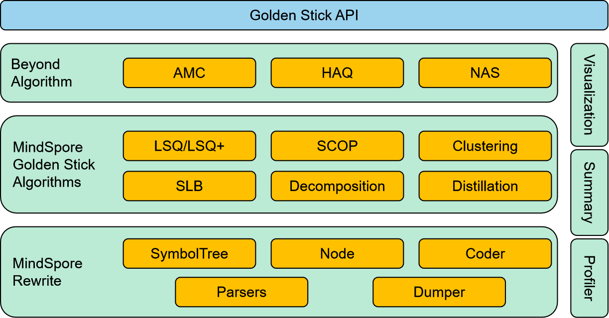

# MindSpore Golden Stick

[View English](./README.md)

<!-- TOC -->

- MindSpore Golden Stick
    - [概述](#概述)
    - [应用MindSpore Golden Stick算法的一般流程](#应用mindspore-golden-stick算法的一般流程)
    - [未来规划](#未来规划)
    - [文档](#文档)
        - [安装](#安装)
        - [快速入门](#快速入门)
        - [压缩算法](#压缩算法)
        - [模型部署](#模型部署)
    - [社区](#社区)
        - [治理](#治理)
        - [交流](#交流)
    - [贡献](#贡献)
    - [许可证](#许可证)

<!-- /TOC -->

## 概述

MindSpore Golden Stick是华为诺亚团队和华为MindSpore团队联合设计开发的一个模型压缩算法集。MindSpore Golden Stick的架构图如下图所示，分为五个部分：

1. 底层的MindSpore Rewrite模块提供修改前端网络的能力，基于此模块提供的接口，算法开发者可以按照特定的规则对MindSpore的前端网络做节点和拓扑关系的增删查改；

2. 基于MindSpore Rewite这个基础能力，MindSpore Golden Stick会提供各种类型的算法，比如SimQAT算法、SLB量化算法、SCOP剪枝算法等；

3. 在算法的更上层，MindSpore Golden Stick还规划了如AMC（自动模型压缩技术）、NAS（网络结构搜索）、HAQ（硬件感知的自动量化）等高阶技术；

4. 为了方便开发者分析调试算法，MindSpore Golden Stick提供了一些工具，如Visualization工具（可视化工具）、Profiler工具（逐层分析工具）、Summary工具（算法压缩效果分析工具）等；

5. 在最外层，MindSpore Golden Stick封装了一套简洁的用户接口。

> 架构图是MindSpore Golden Stick的全貌，其中包含了当前已经实现的功能以及规划在RoadMap中能力。具体开放的功能可以参考对应版本的ReleaseNotes。

## 设计思路

MindSpore Golden Stick除了提供丰富的模型压缩算法外，一个重要的设计理念是针对业界种类繁多的模型压缩算法，提供给用户一个尽可能统一且简洁的体验，降低用户的算法应用成本。MindSpore Golden Stick通过两个举措来实现该理念：

1. 统一的算法接口设计，降低用户应用成本

   模型压缩算法种类繁多，有如量化感知训练算法、剪枝算法、矩阵分解算法、知识蒸馏算法等；在每类压缩算法中，还有会各种具体的算法，比如LSQ、PACT都是量化感知训练算法。不同算法的应用方式往往各不相同，这增加了用户应用算法的学习成本。MindSpore Golden Stick对算法应用流程做了梳理和抽象，提供了一套统一的算法应用接口，最大程度缩减算法应用的学习成本。同时这也方便了后续在算法生态的基础上，做一些AMC、NAS、HAQ等高阶技术的探索。

2. 提供前端网络修改能力，降低算法接入成本

   模型压缩算法往往会针对特定的网络结构做设计或者优化，如感知量化算法往往在网络中的Conv2d、Conv2d + BatchNorm2d或者Conv2d + BatchNorm2d + Relu结构上插入伪量化节点。MindSpore Golden Stick提供了通过接口修改前端网络的能力，算法开发者可以基于此能力制定通用的改图规则去实现算法逻辑，而不需要对每个特定的网络都实现一遍算法逻辑算法。此外MindSpore Golden Stick还会提供了一些调测能力，包括网络dump、逐层profiling、算法效果分析、可视化等能力，旨在帮助算法开发者提升开发和研究效率，帮助用户寻找契合于自己需求的算法。

## 应用MindSpore Golden Stick算法的一般流程

1. 压缩阶段

    压缩阶段是指使用MindSpore Golden Stick算法对网络进行压缩的过程，以量化算法为例，压缩阶段主要包含改造网络为伪量化网络、量化重训或者校正、量化参数统计、量化权重、改造网络为真实量化网络。

2. 部署阶段

    部署阶段是将压缩后的网络在部署环境进行推理的过程，由于MindSpore暂不支持将前端网络进行序列化，所以部署同样需要调用对应的算法接口对网络进行改造，以加载压缩后的checkpoint文件。加载完压缩的checkpoint文件以后的流程和一般的推理流程无异。

> - 应用MindSpore Golden Stick算法的细节，可以在每个算法章节中找到详细说明和示例代码。
> - 流程中的"ms.export"步骤可以参考[导出mindir格式文件](https://www.mindspore.cn/tutorials/zh-CN/master/beginner/save_load.html#保存和加载mindir)章节。
> - 流程中的"昇思推理优化工具和运行时"步骤可以参考[昇思推理](https://www.mindspore.cn/docs/zh-CN/master/model_infer/ms_infer/llm_inference_overview.html)章节。

## 文档

### 安装

请参考[MindSpore Golden Stick安装教程](docs/zh_cn/install.md)。

### 快速入门

以一个简单的算法[Simulated Quantization (SimQAT)](mindspore_gs/quantization/simulated_quantization/README_CN.md) 作为例子，演示如何在训练中应用金箍棒中的算法。

### 压缩算法

<table text-align="center" width="95%">
  <thead>
  <tr>
    <th colspan="8">
概览
</th>
  </tr>
  </thead>
  <tbody>
    <tr>
      <td colspan="2" align="center">
架构
</td>
      <td colspan="2" align="center">
流程
</td>
      <td colspan="2" align="center"><a href="https://www.mindspore.cn/golden_stick/docs/zh-CN/master">APIs</a></td>
      <td colspan="2" align="center"><a href="example/">样例</a></td>
    </tr>
  </tbody>
  <thead>
    <tr>
      <th colspan="8">
自动化压缩(TBD)
</th>
    </tr>
  </thead>
  <thead>
    <tr>
      <th colspan="8"><a href="mindspore_gs/ptq/README_CN.md">
训练后量化
</a></th>
    </tr>
  </thead>
  <tbody>
    <tr>
      <td colspan="4" align="center"><a href="mindspore_gs/ptq/ptq/README_CN.md">PTQ</a></td>
      <td colspan="4" align="center"><a href="mindspore_gs/ptq/round_to_nearest/README_CN.ipynb">RoundToNearest</a></td>
    </tr>
  </tbody>
  <thead>
    <tr>
      <th colspan="8"><a href="mindspore_gs/quantization/README_CN.md">
量化感知训练
</a></th>
    </tr>
  </thead>
  <tbody>
    <tr>
      <td colspan="4" align="center"><a href="mindspore_gs/quantization/simulated_quantization/README_CN.md">SimQAT</a></td>
      <td colspan="4" align="center"><a href="mindspore_gs/quantization/slb/README_CN.md">SLB</a></td>
    </tr>
  </tbody>
  <thead>
    <tr>
      <th colspan="8"><a href="mindspore_gs/pruner/README_CN.md">
剪枝
</a></th>
    </tr>
  </thead>
  <tbody>
    <tr>
      <td colspan="2" align="center"><a href="mindspore_gs/pruner/scop/README_CN.md">SCOP</a></td>
      <td colspan="3" align="center"><a href="mindspore_gs/pruner/uni_pruning/README.md">uni_pruning(demo)</a></td>
      <td colspan="3" align="center"><a href="mindspore_gs/pruner/heads/lrp/README.md">LRP(demo)</a></td>
    </tr>
  </tbody>
  <thead>
    <tr>
      <th colspan="8">
其他
</th>
    </tr>
  </thead>
  <tbody>
    <tr>
      <td colspan="8" align="center"><a href="mindspore_gs/ghost/README_CN.md">Ghost</a></td>
    </tr>
  </tbody>  
</table>

### 模型部署

请参考[MindSpore Golden Stick部署教程](docs/zh_cn/deployment/overview.md)。

## 社区

### 治理

查看MindSpore如何进行[开放治理](https://gitee.com/mindspore/community/blob/master/governance.md)。

### 交流

- [MindSpore Slack](https://join.slack.com/t/mindspore/shared_invite/zt-dgk65rli-3ex4xvS4wHX7UDmsQmfu8w) 开发者交流平台。

## 贡献

欢迎参与贡献。

## 许可证

[Apache License 2.0](https://gitee.com/mindspore/golden-stick/blob/master/LICENSE)
