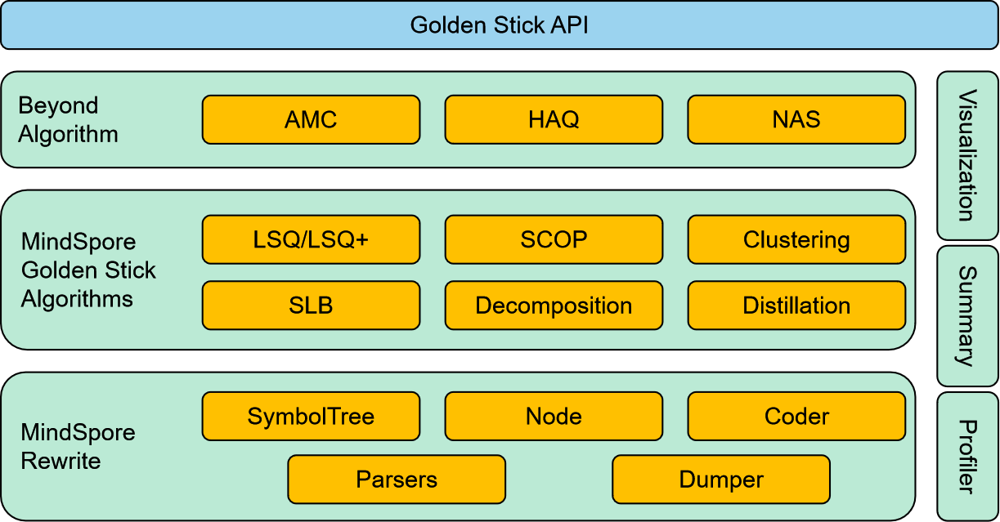

# Architecture

The architecture diagram is the overall picture of MindSpore Golden Stick, which includes the features that have been implemented in the current version and the capabilities planned in RoadMap. Please refer to release notes for available features in current version.

## Design Features

In addition to providing rich model compression algorithms, an important design concept of MindSpore Golden Stick is try to provide users with the most unified and concise experience for a wide variety of model compression algorithms in the industry, and reduce the cost of algorithm application for users. MindSpore Golden Stick implements this philosophy through two initiatives:

1. Unified algorithm interface design to reduce user application costs:

   There are many types of model compression algorithms, such as quantization-aware training algorithms, pruning algorithms, matrix decomposition algorithms, knowledge distillation algorithms, etc. In each type of compression algorithm, there are also various specific algorithms, such as LSQ and PACT, which are both quantization-aware training algorithms. Different algorithms are often applied in different ways, which increases the learning cost for users to apply algorithms. MindSpore Golden Stick sorts out and abstracts the algorithm application process, and provides a set of unified algorithm application interfaces to minimize the learning cost of algorithm application. At the same time, this also facilitates the exploration of advanced technologies such as AMC, NAS and HAQ based on the algorithm ecology.

2. Provide front-end network modification capabilities to reduce algorithm development costs：

   Model compression algorithms are often designed or optimized for specific network structures. For example, perceptual quantization algorithms often insert fake-quantization nodes on the Conv2d, Conv2d + BatchNorm2d, or Conv2d + BatchNorm2d + Relu structures in the network. MindSpore Golden Stick provides the ability to modify the front-end network through API. Based on this ability, algorithm developers can formulate general network transform rules to implement the algorithm logic without needing to implement the algorithm logic for each specific network. In addition, MindSpore Golden Stick also provides some debugging capabilities, including visualization tool, profiler tool, summary tool, aiming to help algorithm developers improve development and research efficiency, and help users find algorithms that meet their needs.

## General Process of Applying the MindSpore Golden Stick

1. Compress Phase

    Taking the quantization algorithm as an example, the compression phase mainly includes transforming the network into a fake-quantized network, quantization retraining or calibration, quantizing parameter statistics, quantizing weights, and transforming the network into a real quantized network.

2. Deplyment Phase

    The deployment phase is the process of inferring the compressed network in the deployment environment. Since MindSpore does not support serialization of the front-end network, the deployment also needs to call the corresponding algorithm interface to transform the network to load the compressed checkpoint file. The flow after loading the compressed checkpoint file is the same as the normal inference process.

> - For details about how to apply the MindSpore Golden Stick, see the detailed description and sample code in each algorithm section.
> - For details about the "ms.export" step in the process, see [Exporting MINDIR Model](https://www.mindspore.cn/tutorials/en/master/beginner/save_load.html#saving-and-loading-mindir).
> - For details about the "MindSpore infer" step in the process, see [MindSpore Inference Runtime](https://www.mindspore.cn/tutorials/en/master/model_infer/ms_infer/ms_infer_model_infer.html).
