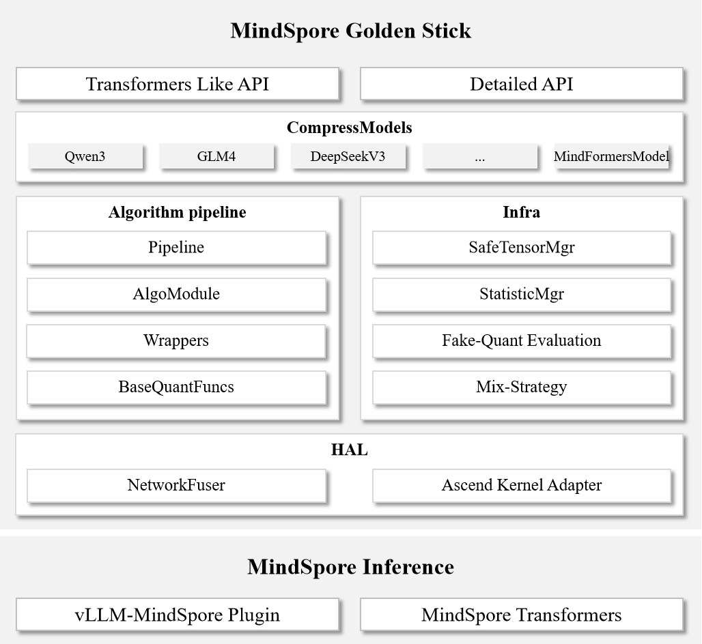

# Architecture Design

## Golden Stick Architecture

We analyzed some [industry model compression framework practices](https://atomgit.com/mindspore/golden-stick/wiki/%E8%BD%AF%E4%BB%B6%E8%AE%BE%E8%AE%A1%2F%E9%87%91%E7%AE%8D%E6%A3%92%E8%AE%BE%E8%AE%A1%E6%96%87%E6%A1%A3.md#%E4%B8%9A%E7%95%8C%E5%AE%9E%E8%B7%B5%E8%B0%83%E7%A0%94) and summarized some excellent characteristics:

- **Minimal Ease-of-Use**: Represented by LLM Compressor, deeply integrated with Transformers, providing **a minimal API design**. It has a gentle learning curve and excellent ease of use. Although algorithms are highly encapsulated, it rapidly tracks frontier algorithms in the **LLM domain**, meeting the needs of quick onboarding, deployment, and verification—an ideal choice for LLM users.

- **Fine-Grained Configuration**: Represented by DeepSpeed Compression, providing **finely configurable APIs**, which require a certain learning cost to understand the principles and parameters of compression algorithms. Its **rich and composable algorithm library** supports building compression pipelines like building blocks; the modular architecture facilitates integrating custom algorithms—more than a toolbox, it is a **research platform**.

- **Extreme Performance**: Taking TensorRT as an example; as a CUDA runtime rather than a dedicated model compression tool, it implements quantization and sparsity via a plugin mechanism (custom operators, passes, etc.), **delivering extreme inference performance on NVIDIA hardware**, widely used in production environments, but with a high technical threshold.

Based on the above observations, we hope that Golden Stick is both an easy-to-use model compression tool and a research platform for algorithm researchers. We have defined several goals:

- **Easy-to-use Flexible APIs**: Multi-level APIs that balance ease of use and flexibility, lowering the usage barrier while retaining algorithm customization capabilities;
- **Rich and Modular Algorithm Library**: Provides a rich set of compression algorithms and supports flexible composition;
- **Highly Extensible Framework Architecture**: Facilitates the integration of custom algorithm modules, and combined with flexible APIs, helps build customized compression pipelines.

### API Design

Golden Stick provides multi-level API design:

- **Level 0 Interface**: Similar to DeepSpeed Compression’s configuration-style API, offering rich configuration options for compression algorithms to support on-demand customization.
- **Level 1 Interface**: Similar to Transformers’ concise API, supports rapid application of built-in compression algorithms, directly optimizing Transformers networks and Hugging Face weights.

### Algorithm Pipeline

- **Layered Architecture Design**: Adopts a four-layer architecture (Pipeline, AlgoModule, Wrappers, BaseQuantFuncs), supports customizing components at any level, reuses low-level capabilities, and accelerates experimentation with new algorithms.
- **Chain-of-responsibility Pattern**: Pipeline and AlgoModule are designed based on the chain-of-responsibility pattern to achieve modularity; users can flexibly compose different AlgoModules to build customized compression pipelines.

### Infrastructure

#### Compatibility with Hugging Face Weights

This section mainly discusses the implementation of Hugging Face compatibility related to post-training quantization.

1. **Hugging Face Weight Loading**
    - MindOne provides a Transformers-like interface and supports directly loading Hugging Face formatted weights;
    - MindFormers provides a dedicated interface and supports building networks from Hugging Face weight files.

2. **Hugging Face Quantized Weight Export**
    - Merge TP-parallel weights into the Hugging Face format split by parameter names and save them as safetensors files;
    - Generate the safetensors index file `index.json`;
    - Update `config.json`, add quantization configuration information for the inference framework to construct quantization methods;
    - Save the quantization description file for the inference framework to build quantized networks;
    - Keep all other files in the original weight directory.

#### Fake-Quantization Evaluation

This section mainly discusses accuracy evaluation methods related to post-training quantization.

Fake-Quantization Evaluation is an accuracy evaluation method that does not rely on an inference framework. Its core idea is to insert fake-quantization operators into a floating-point network, introducing quantization errors to simulate the real quantized inference process. This method can independently evaluate the accuracy loss caused by the quantization algorithm itself, excluding additional errors introduced by the inference framework or performance optimization features, which facilitates accuracy analysis.

**Limitations**:

1. **Algorithm Compatibility Limitation**: Some algorithms cannot be accurately simulated through fake-quantization. For example, FAQuant needs to introduce quantization error in the intermediate calculations of the FlashAttention fused operator; if the network uses the FlashAttention fused operator, fake-quantization evaluation cannot be performed.

2. **Large Performance Overhead**: The inference performance of fake-quantization evaluation is significantly lower than normal inference. Especially for long-sequence inference scenarios such as CoT (Chain-of-Thought), evaluation is time-consuming.

#### Mixed Strategy

To balance the compression rate and accuracy, it is often necessary to adopt differentiated algorithm strategies based on the characteristics of different layers in the network.

Golden Stick provides a two-level strategy configuration system:

- **Network-Level Strategy**: A global compression strategy that takes effect on all algorithm-sensitive layers in the network;
- **Layer-Level Strategy**: Configure dedicated compression strategies for specific layers matched via regular expressions; it has a higher priority than the network-level strategy.

### Ascend Hardware Adaptation Layer

- **Network Fusion Optimization**: Operator fusion is a fundamental but effective technique for inference optimization. Original Transformers networks are usually not fused. To ensure that the compressed network still has fusion capability, algorithm design needs to consider fusion modules in a unified manner. We abstract and encapsulate fusion capabilities via `NetworkFuser`, and design `StatisticMgr` to avoid repeated computation, improving overall efficiency.

- **Operator Specification Adaptation**: Ascend hardware has specific requirements for certain operators (e.g., 8-bit full quantization requires both left and right matrices to be symmetrically quantized, and offsets need to be converted to bias). Golden Stick provides dedicated adaptation modules to ensure that quantized weights meet Ascend operator specifications.

### Algorithm-Inference Decoupling

Golden Stick adopts an architecture design that separates algorithms from inference:

1. **Algorithm Independence**: Directly compress Transformers networks without relying on the network definitions in specific deployment frameworks (such as the vLLM-MindSpore Plugin);
2. **Fake-Quantization Evaluation**: Supports accuracy evaluation independent of inference frameworks, facilitating validation of algorithm effectiveness;
3. **Standardized Interface**: Uses the Hugging Face community weight format as the standard interface between algorithms and inference frameworks, enabling compress-once, deploy-everywhere.

The decoupled algorithm–inference architecture improves the generality of the output quantized weights and reduces maintenance costs.

**Deployment Verification**: Golden Stick's quantized weights have been deployed and verified on the [vLLM-MindSpore Plugin](https://atomgit.com/mindspore/vllm-mindspore) and [MindSpore Transformers](https://atomgit.com/mindspore/mindformers). Based on the standardized design of the Hugging Face format, it is theoretically supported to attempt deployment on other inference frameworks.
