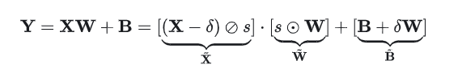
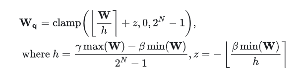
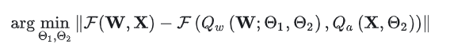
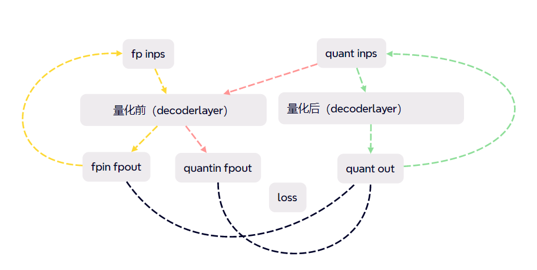

# 应用OmniQuant算法

[]()

## 背景

OmniQuant是一种PTQ量化算法，其具体原理来源于香港大学的[论文](https://arxiv.org/abs/2308.13137)，是一种应用可微分量化实现块间量化误差最小化的算法。

### 可学习等效变换（LET）

通过可学习的等效变换（LET）可以进一步降低了权重-激活量化的难度。

- 先前的方法如[SmoothQuant](https://arxiv.org/abs/2211.10438)通过数学等效变换将量化难度从激活转移到权重。然而，他们的等效参数是人工设置的，导致次优结果。
- 受到SmoothQuant和[Outlier Suppression+](https://arxiv.org/abs/2304.09145)启发，OmniQuant采用channel-wise scaling和channel-wise shifting来操纵激活分布，为异常值问题提供了有效的解决方案。
- LET模块在Linear线性层中可以按如下公式进行转换



### 可学习权重裁剪（LWC）

- LWC模块来降低LLM中权重量化的难度。与具有learnable clipping threshold的先前方法类似（如LSQ、PACT等），LWC也通过优化clipping threshold来确定权重的最佳动态范围。
- 但是LWC不是像之前的方法那样直接学习clipping threshold，而是优化一个clipping strength，利用两个参数控制最大最小值变化，实现动态范围的变化。如下图公式：



## 块级量化误差最小化

- 之前采用梯度优化的PTQ方法，如AdaRound和BRECQ，不能应用于具有数十亿参数的模型，因为巨大的解空间难以优化这些权重。
- OmniQuant提出了一种新的优化流水线，采用块间量化误差最小化，其中额外的量化参数可以以可微分的方式优化。
- OmniQuant可以联合优化LWC和LET中的量化参数，使其足以包含仅权重和权重-激活量化。可以将优化总目标表述如下：



## OmniQuant实现示例

OmniQuant与MindSpore Golden Stick其他PTQ算法流程基本一致，完整流程如下：

1. 定义网络。
2. 定义MindSpore Golden Stick量化算法，应用算法封装量化网络。
3. 定义优化器、损失函数和训练的参数。
4. 量化网络，按块级依次训练量化参数。
5. 评估网络，对比量化后精度。

### 定义网络

通过mindformers引入llama2网络

```python
config = create_mfconfig(uargs.config_path, uargs.device_id, 1, 2048 ckpt_path=uargs.fp_ckpt_path)
network = LlamaForCausalLM(config.model.model_config)
tokenizer = LlamaTokenizer(vocab_file=uargs.tokenizer_path)
```

### 应用量化算法

量化网络是指在原网络定义的基础上，修改需要量化的网络层后，生成带有量化方法的网络，通过构造MindSpore Golden Stick下的`OQLinearWrapper`类，并将其应用到原网络上将原网络转换为量化网络。

```python
def apply( network: Cell) -> Cell:
        """Apply"""
        op_types=[nn.Dense,nn.Conv2d,Linear]
        def _replace(root: Cell):
            if root is None:
                return
            for name, cell in root.name_cells().items():
                if type(cell) in op_types:
                    cell_wrapper = OQLinearWrapper(cell)
                    root.insert_child_to_cell(name, cell_wrapper)
                else:
                    _replace(cell)

        _replace(network)
        network.update_parameters_name()
        return network
qnet = apply(model)
```

量化网络结构如下，其中OQLinearWrapper为感知量化训练对原有Linear的封装类，包括了原有的算子以及输入输出和权重的量化方法所对应的函数。在OQLinearWrapper中定义了激活和权重平滑操作的LET训练参数smoothscale和权重裁剪范围的LWC训练参数lowbound，upbound。

### 定义优化器、损失函数和训练的参数

使用AdamWeightDecay作为llama2网络量化参数训练的优化器；使用MSELoss作为llama2网络量化参数训练的损失函数：

```python
layer=model.layers[i]
all_params1 = layer.get_parameters()
all_params2 = layer.get_parameters()
all_params3 = layer.get_parameters()
lwc_low_params = list(filter(lambda x: "lowbound" in x.name, all_params1))
lwc_up_params = list(filter(lambda x: "upbound" in x.name, all_params2))
let_params = list(filter(lambda x: "smoothscale" in x.name, all_params3))
omi_params = [{'params': let_params, 'lr': 0.00001},{'params': lwc_low_params, 'lr': 0.0005},{'params': lwc_up_params, 'lr': 0.0005}]
optimizer = nn.AdamWeightDecay(params = omi_params)
loss_fn = nn.MSELoss()
```

### 量化网络，按块级依次训练量化参数

通过Mindspore value_and_grad自动微分，对LET和LWC参数进行训练，其中loss计算可分成两部分，第一部分通过比较反量化后结果与全精度输入输出结果计算损失，第二部分通过比较反量化后结果与上一层量化后输出结果作为这一层输入的输出结果计算损失。这样的损失计算可以有效减少块级误差并且避免误差累积。loss计算可参考下图。



```python
def forword_fn(inputs, targets1, targets2):
    smoothandquant(layer)
    layer.set_train(True)
    logits = layer(inputs,freqs_cis, mask)
    loss1 = loss_fn(logits, targets1)
    loss2 = loss_fn(logits, targets2)
    loss = loss1+loss2
    return loss, logits

grad_fn = ms.value_and_grad(forword_fn, None, optimizer.parameters)

def train_step(inputs,targets1, targets2):
    layer.set_train(True)
    (loss, logits), grads = grad_fn(inputs, targets1, targets2)
    optimizer(grads)
    return loss, logits

loss, logits = train_step(quantin,quantinfpout, fpinfpout)
```

### 评估网络，对比精度

```python
prompts = ['I love Beijing, because']
 for prompt in prompts:
        input_ids = tokenizer(prompt)['input_ids']
        _ = network.generate(input_ids, do_sample=False, max_length=512)
        print(f'量化前结果为{_}')
        print(f'量化前结果为{tokenizer.decode(_)}')

    print('------------ quant llama2 to W8A16 ------------', flush=True)

    model = network.model
    quantmodel = omniquant(model=model,tokernizer=tokenizer,max_length=512)
    network.model = quantmodel

    print('------------ quant finished ------------', flush=True)
    for prompt in prompts:
        input_ids = tokenizer(prompt)['input_ids']
        _ = network.generate(input_ids, do_sample=False, max_length=512)
        print(f'量化后结果为{_}')
        print(f'量化后结果为{tokenizer.decode(_)}')

    ms.save_checkpoint(network, f"llama2-w8a8{uargs.device_id}.ckpt")
```

```text
量化前结果为[array([    1,   306,  5360,  1522,   823,   292, 29892,  1363,   372,
         338,   263,  4272,   393,   338, 21003,  6480, 29889,   306,
         505,  1063,  8471,  1244,   363, 29871, 29896, 29900,  2440,
         322,   306,   505,  3595,   278,  4272,  1735,   577,  1568,
       29889,   306], dtype=int32)]
量化前结果为['<s>I love Beijing, because it is a city that is constantly changing. I have been living here for 10 years and I have seen the city change so much. I']

...

量化后结果为[array([    1,   306,  5360,  1522,   823,   292, 29892,  1363,   372,
         338,   263,  4272,   393,   338, 21003,  6480, 29889,   306,
         505,  1063,  8471,  1244,   363, 29871, 29896, 29900,  2440,
         322,   306,   505,  3595,   278,  4272,  1735,   577,  1568,
       29889,   306], dtype=int32)]
量化后结果为['<s>I love Beijing, because it is a city that is constantly changing. I have been living here for 10 years and I have seen the city change so much. I']

```

> 从该简单测试示例中看出，量化前和量化后的语句输出保持一致。该示例中仅实现权重的量化，将权重量化为Int8，最终量化完的ckpt文件大小约为原文件的52%。

## 参考文献

[1] Shao, Wenqi, et al. Omniquant: Omnidirectionally calibrated quantization for large language models. arXiv preprint arXiv:2308.13137 (2023).

[2]Guangxuan Xiao, Ji Lin, Mickael Seznec, Hao Wu, Julien Demouth, and Song Han. Smoothquant:Accurate and efficient post-training quantization for large language models. In International Conference on Machine Learning, pp. 38087–38099. PMLR, 2023.

[3]Xiuying Wei, Yunchen Zhang, Yuhang Li, Xiangguo Zhang, Ruihao Gong, Jinyang Guo, and Xianglong Liu. Outlier suppression+: Accurate quantization of large language models by equivalent and optimal shifting and scaling. arXiv preprint arXiv:2304.09145, 2023.
