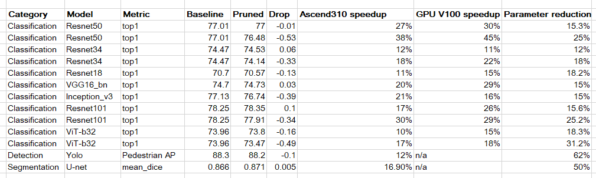

# Applying the UniPruning Algorithm

## Background

During recent years Deep Learning reached significant breakthrough in many practical problems, such as Computer Vision (e.g. object detection, segmentation and face identification), Natural Language Processing and speech recognition and many others. For many years the main goal of research was to improve quality of models, even if model size and latency was impractically high. However for production solutions, which are often require real-time work, latency of the model plays very important role. Relatively small number of researches considered model complexity limitations and typically for such works FLOPS metric of model has been used as a complexity measure.

For specialized devices FLOPS measure is too abstract and often do not reflect real latency of model. For specific applications hardware constraints should be taken into account during model’s architecture design. UniPruning is a pruning algorithm which has been designed to work with specialized devices.

## Pruning

Pruning – class of methods for removing weights in Neural Network aiming to decrease model’s size and its computational complexity without significant performance drop.

There are different ways to prune a neural network:

* **Pruning weights**: This is done by setting individual parameters to zero and making the network sparse. This would lower the number of parameters in the model while keeping the architecture the same. Usually such methods have lowest accuracy degradation, but they don't provide computation acceleration without specialized hardware accelerators for sparse calculations, only data transfer acceleration or storage compression.
* **Pruning filters**: This is done by removing whole filter from weights. This would make the network architecture itself smaller. It is a bit difficult to get low accuracy degradation, but it could make network faster on platforms with accelerated vector computations.
* **Pruning groups of filters**: This is done by removing multiple filters at the same time. Among the mentioned methods it is the most difficult in saving accuracy, but result networks are the fastest on platforms with accelerated matrix multiplications such as GPU or TPU.

## UniPruning

**UniPruning** is a soft-pruning algorithm. It measures relative importance of channels in a hardware-friendly manner. Particularly, it groups channels in groups of size G, where each channel's importance is measured as a L2 norm of its weights multiplied by consecutive BatchNorm's gamma, channels are sorted by their importance and consecutive channels are groupped. The absolute group importance is given as the median of channel importances. The relative importance criteria of a channel group G group of a layer L is measured as the highest median of the layer L divided by the median of group G. The higher the relative importance of a group, the less a group contributes to the layer output.

During training UniPruning algorithm every N epochs searches for channel groups with the highest relative criteria network-wise and zeroes channels (UniZeroing) in that groups until reaching target sparsity, which is gives as a % of parameters to prune. To obtain pruned model after training, pruning mask and zeroed weights from the last UniPruning step are used to physically prune the network.

The hyper-parameters of UniPruning are:

Target sparsity - compression rate of the model.
Frequency - number of fine-tuning epochs between each UniZeroing step.
Pruning step - size of groups, e.g. 32 means that filters are groupped by 32.
Filter lower threshold - minimal number of channels that stays in layer after pruning.

Table 1: UniPruning training specifications

| Specifications        | Description |
| ------------ | -------------------- |
| Hardware    | GPU and Ascend AI 910 Processor hardware platforms |
| Networks    | Networks consists of only allowed list of layers/operations: Conv2D, Dense, BatchNorm2D, Add, BiasAdd|
| Algorithms    | Structured pruning algorithms |
| Data types| The Ascend and the GPU platforms support pruning training on FP32 networks.|
| Running modes| Graph mode and PyNative mode |

Main differences from other algorithms:

* Pruning groups of filters

    Hardware with accelerated matrix multiplications represents convolutions and dense layers as multiplication of some big matrices. These matrices splits into patches which multiplied on special matrix/tensor unit with corresponding width. For CUDA the size of patch (width of tensor unit) is 8 (for FP16) or 4 (for TF32), for Ascend - 16 (for FP16) or 32 (for INT8). To make this multiplication efficient, input data should be aligned by the size of patch. It means that number of channels of intermediate feature tensors, number of output and input channels for convolutions and dense layers should be divisible by tensor unit width. For example, if only one filter will be removed from dense layer, this layer could become even slower (additional time needed on aligning input and output data). UniPruning takes it into account and prunes filters with save of data alignment.
* Dynamic selection of layers for pruning

    Other structured pruning algorithms usually prune filters by some ratio equally for all layers. There are two disadvantages of such approach. Firstly, for some layer all filters could be important. And there could be a layer which has a lot of unimportant filters. So pruning layers equally is not good approach. Secondly, pruning layers with small number of output channels could break divisibility by tensor unit width and make layer slower. UniPruning finds most unimportant groups of filters in whole network, not for each layer separately. So it could prune a lot of unimportant filters in one layer and zero filters in another. And it will save channels divisibility by tensor unit width on each step of pruning.

## UniPruning Training Example

There are two modes for UniPruning:

* **Training from scratch**: pruning turns on at the beginning of training.
* **Training from pretrained weights**: pruning will finetune pretrained weights.

If you want to prune already trained model, you just have to load pretrained weights and configure learning rate for finetuning.

```python
    import mindspore as ms
    from mindspore_gs.pruner.uni_pruning import UniPruner

    ## 1) Fill pruning configuration dictionary
    cfg = {
        "exp_name": "unipruning",        # Experiment name. Checkpoints and masks would be named as exp_name_epoch
        "frequency": 9,                  # Each frequency epochs model would be zeroed under UniPruning algorithm.
        "target_sparsity": 0.75,         # Target compression rate of the pruned model.
        "pruning_step": 32,              # The number of channels which would be zeroed/pruned as a single unit/group.
        "filter_lower_threshold": 32,    # The minimal number of channels in each layer in a pruned model.
        "input_size": (16, 3, 224, 224), # The shape of input tensor when exporting model into .MINDIR and .AIR.
        "output_path": "./outputs",      # Path into which zeroed/pruned checkpoints and pruning masks would be saved.
        "prune_flag": 1,                 # If set to 1, UniPruning is enabled. If set to 0, UniPruning is disabled.
        "rank": 0,                       # Local rank of the model when used in distributed training
        "device_target": "Ascend"        # Device on which experiment is performed (Ascend, GPU).
    }

    ## 2) Create network for pruning
    net = NetToPrune()

    ## 3) Define Pruning algorithm
    algo = UniPruner(cfg)

    ## 4) Apply pruning algorithm to origin network
    algo.apply(net)

    ## 5) Train network for several epochs as usual

    ## 6) Load pruning mask and checkpoint which have been generated during training
    if config.mask_path is not None and os.path.exists(config.mask_path):
        with open(config.mask_path, 'r', encoding='utf8') as json_fp:
            mask = json.load(json_fp)
            tag = 'pruned'
    else:
        mask = None
        tag = 'original'
    ms.load_checkpoint(config.checkpoint_file_path, net)

    ## 7) Make pruning, save pruned network
    algo.convert(net, mask, config, tag)
```

## Summary



## Ascend porting notes

If you plan to use INT8 Quantization together with pruning, you have to use 32 pruning step size,
otherwise - 16.

If your target device is Ascend 310/710/910 and you will use ATC utility to convert model into OM-file,
you have to multiply pruning step size (group size) by a number of cores which you plan to use. It is
because model parallelizm could be used to distribute computations between cores. Then intermediate
feature tensors will be aligned by NUM_CORES * (16 or 32 depending on your data type).
