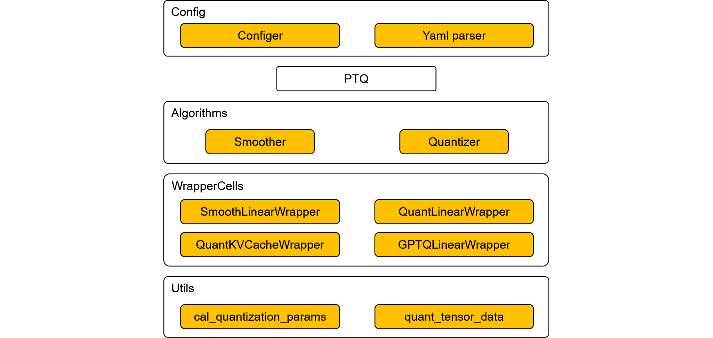
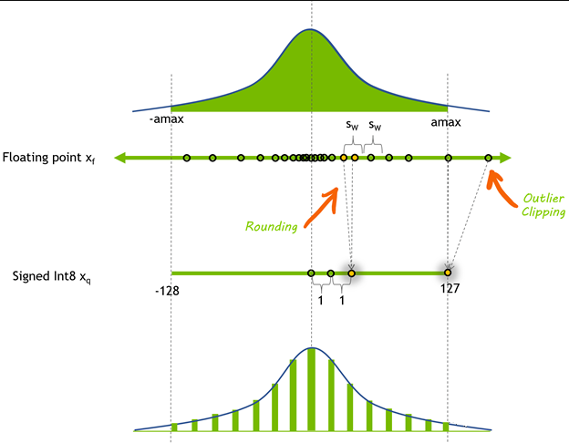
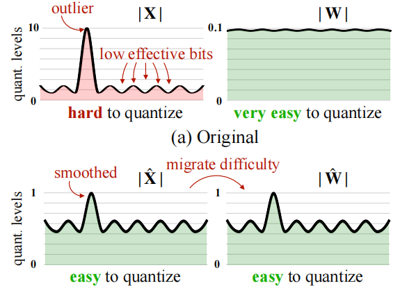
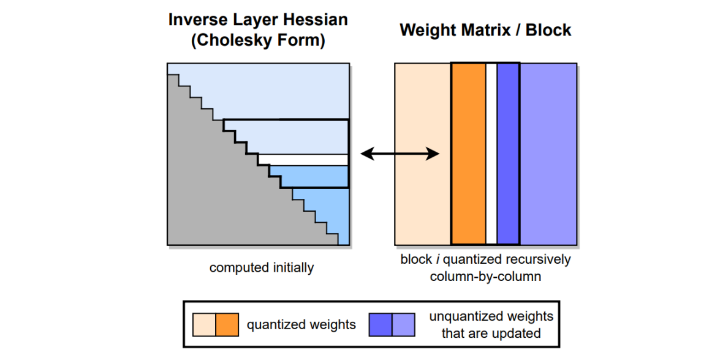
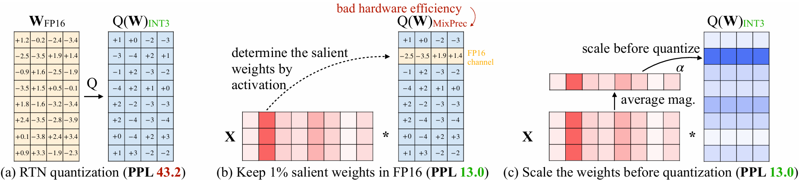

# Applying the PTQ Algorithm

[](https://gitee.com/mindspore/golden-stick/blob/r1.0.0/mindspore_gs/ptq/ptq/README.md)

[查看中文](./README_CN.md)

## Introduction to the PTQ Algorithm

### Original Purpose

In order to realize the combined quantization algorithm, as well as subsequent support for complex quantization algorithms such as mixed-precision quantization and automatic optimization search, MindSpore introduces a post-training quantization algorithm called PTQ. This algorithm relies on MindSpore's front-end parallelism to realize more complex algorithm implementation logic.

The algorithm is able to provide the capability of both RoundToNearest and SmoothQuant quantization algorithms, and subsequent new post-training quantization algorithms will evolve on this algorithm, so we named the algorithm PTQ.

### Design Ideas



Layered implementation of quantization algorithms, mainly divided into config, quantization algorithm, algorithm module, quantized Cell, quantization tool function.

- config is mainly used for user configuration algorithms, and implements yaml serialization deserialization capabilities.
- The quantization algorithm is the main entrance of the algorithm, the PTQ algorithm is also inherited from the Golden Stick algorithm base class CompAlgo, which implements the apply and convert interfaces to realize the quantization checkpoint and the quantization deployment network export functions respectively.
- Algorithm modules are some modularized functional blocks. For example, the Smooth module for the Linear layer and the Quantization module for the Linear and KVCache layers are built into this PTQ algorithm. By assembling these modules, various algorithms can be implemented, such as the SmoothQuant algorithm. This ensures that the PTQ algorithm is highly scalable and flexible.
- Quantized Cell is a quantized network layer obtained by encapsulation for a specific non-quantized network layer, which is used to realize the quantization of a specific network layer. The quantized network layer is introduced by registration, which realizes the decoupling between different network frameworks, such as the decoupling of Golden Stick and MindFormers.
- Quantization tool functions are some basic tool functions, such as the calculation of quantization parameters, quantization of matrices and so on.

### Support Range

Table 1: PTQ algorithm specifications

| Specifications | Specification Descriptions |
| --- | --- |
| Hardware Support | Atlas 800I A2 |
| Network Support | ParallelLlamaForCausalLM. For details, refer to [ParallelLlamaForCausalLM Network](https://gitee.com/mindspore/mindformers/blob/dev/mindformers/experimental/infer/models/llama/llama.py). |
| Operation Mode Support | The quantization checkpoint phase supports only PyNative mode, and the quantization inference phase is not limited to modes, suggesting GraphMode for better performance. |

> The current PTQ algorithm relies on the complete DecoderLayer to do the network topology analysis, so it does not support any network constructed based on the Linear layer of MindFormers. We plan to improve this in the subsequent version to enhance the network generalization ability of the PTQ algorithm.

### Algorithmic Support

Post-training quantization algorithms have many kinds of classification dimensions, such as static quantization and dynamic quantization; weight quantization, activation quantization, and KVCache quantization; MinMax quantization, MSE quantization, KL scatter quantization, and histogram quantization; as well as a variety of quantization optimization techniques, ranging from the simplest rounding quantization to SmoothQuant quantization, GPTQ quantization, AWQ quantization, and so on.

This subsection describes the capabilities of the PTQ algorithm in terms of common quantization algorithm paradigms in the industry, before giving some limitations on other categorization dimensions:

- Only MinMax quantization is supported.
- Support static per-tensor activation quantization and per-channel weight quantization. Support dynamic per-token activation quantization.
- Support static per-channel KVCache quantization and dynamic per-token KVCache quantization.
- Limited by hardware and operator support, for full quantization, activation does not support per-channel quantization and weights do not support quantization with zero point.
- The hardware supports weight quantization with zero point, but the current PTQ algorithm does not open this capability and only supports weight quantization without zero point.
- The PTQ algorithm has done a layered design, and the current underlying quantization operator only supports some Layers of MindFormers, because the PTQ algorithm only supports doing weight quantization and activation quantization for [Linear Layer of MindFormers](https://gitee.com/mindspore/mindformers/blob/dev/mindformers/modules/layers.py#L363 ) to do weight quantization and activation quantization, and for [MindFormers' PageAttention layer](https://gitee.com/mindspore/mindformers/blob/dev/mindformers/modules/paged_attention_mgr.py#L26 ) to do KVCache quantization. If the user needs to quantize the network that is not based on MindFormers, the user is required to provide the relevant quantization operator implementation, the current customization capability in this regard does not form a clear interface, will be provided in the future.

#### RoundToNearest Algorithm

RoundToNearest algorithm is a class of plainer post-quantization algorithms, which use Round to nearest, i.e. rounding, hence the name RoundToNearest. The algorithm capability is similar to the independent [RoundToNearest](../round_to_nearest/README.md) algorithm capability by Golden Stick, which will stop evolving the RoundToNearest algorithm and use the PTQ algorithm to support the RoundToNearest algorithm capability.

##### 1. Quantization Process



The main logic of the quantization algorithm is to calculate the quantization parameters based on floating point data such as the maximum and minimum values of weights and the maximum and minimum values of integer data according to the formula:

$$scale = \frac{X_{{float}_{max}} - {X_{float}}_{min}} {X_{{int}_{max}} - {X_{int}}_{min}}$$

$$offset = round(X_{{int}_{max}} - \frac{X_{{float}_{max}}} {scale})$$

Where scale is the scaling factor and offset is the translation factor, both collectively known as quantization parameters. After obtaining the quantization parameters, the weights can be quantized:

$$x_{int} = clamp(round(x_{float} \div scale) + offset; 0, 2^b-1)$$

This involves the round operation, which is a rounding operation, which is the meaning of the RoundToNearest algorithm and is part of the source of error in this quantization algorithm.

##### 2. Weight Quantization

The above quantization process is applied to the weight matrix in the network by converting it to 8bit integer for storage. After loading the 8bit weights at deployment time, they are inversely quantized and the mathematical expression of the process is as follows:

$$X_{float} = (X_{int} - offset) \times scale$$

After inverse quantization of weights to floating point, the inference process of the network is no different from the general floating point network inference process. Weight quantization does not bring about a reduction in computation, on the contrary, inverse quantization will bring about additional computation, so the operation of inverse quantization is usually fused with the subsequent floating point computation process, which can effectively reduce the memory overhead in the deployment phase, and at the same time alleviate the Memory Bound in the incremental inference phase of the large language model, which both can improve the throughput of the large language model when deployed.

PTQ RoundToNearest Algorithm currently supports only 8bit weight quantization capability, which can be enabled by the following configuration item:

```python
from mindspore import dtype as msdtype
from mindspore_gs.ptq import PTQConfig, OutliersSuppressionType

ptq_config = PTQConfig(weight_quant_dtype=msdtype.int8,  act_quant_dtype=None,  kvcache_quant_dtype=None,
                       outliers_suppression=OutliersSuppressionType.NONE)
```

##### 3. KVCache Quantization

Applying the above quantization process to the KVCache generated during the inference process of the large language model, the computed KVCache is quantized and stored, and then the KVCache is inversely quantized before the Attention computation, so as to alleviate the memory consumption of the KVCache in order to support the generation of the large language model with a larger batch size or a longer sequence. It should be noted that KVCache is generated during inference, so quantization against KVCache requires a small number of datasets for calibration.

PTQ currently supports only 8bit KVCache quantization capability, which can be enabled by the following configuration item:

```python
from mindspore import dtype as msdtype
from mindspore_gs.ptq import PTQConfig, OutliersSuppressionType

ptq_config = PTQConfig(weight_quant_dtype=None, act_quant_dtype=None, kvcache_quant_dtype=msdtype.int8,
                       outliers_suppression=OutliersSuppressionType.NONE)
```

#### SmoothQuant Algorithm

It is found that, unlike CNNs and small transformer networks, when the number of parameters of the large language model exceeds 6.8B, "systematic outliers with large magnitude" appear in the activation of the network, which is difficult to quantify due to the wide and heterogeneous distribution of floating points.



The [SmoothQuant](https://arxiv.org/pdf/2211.10438) algorithm transfers a portion of the outliers on the activations to the weights through a mathematically equivalent transformation, thus transforming the difficult-to-quantify activations and very easy-to-quantify weights into easy-to-quantify activations and easy-to-quantify weights, and realizing the improvement of quantization accuracy.

User can enable the SmoothQuant capability of PTQ with the following configuration item:

```python
from mindspore import dtype as msdtype
from mindspore_gs.ptq import PTQConfig, OutliersSuppressionType

ptq_config = PTQConfig(weight_quant_dtype=msdtype.int8, act_quant_dtype=msdtype.int8, kvcache_quant_dtype=msdtype.int8,
                       outliers_suppression=OutliersSuppressionType.SMOOTH)
```

#### Dynamic Quantization Algorithm

Currently, the Golden Stick supports only per-token dynamic quantization. The per-token quantization algorithm refers to the allocation of independent quantization parameters for each token to minimize errors. Dynamic quantization implies that the quantization parameters are computed in real time during the inference phase, without the need for offline calculation of quantization parameters.

per-token dynamic quantization algorithm is to execute per-token online quantization of activation or KVcache in the process of inference, and calculate the scale and zp of token dimension online without using dataset for calibration quantization, which is more accurate than offline static quantization. Currently, per-token dynamic quantization supports only symmetric quantization.

##### Activation per-token Dynamic Quantization

For activation per-token dynamic quantization, RoundToNearest quantization of weights is required first, and then we can use quantized weights to perform W8A8-per-token inference. per-token dynamic quantization with activation also supports smooth operation, so smooth parameters can be calculated during the quantization process.

- Activation per-token Dynamic Quantization With Smooth Parameter

    If you want to include the smooth parameter, the corresponding configuration items are as follows.

    ```python
    from mindspore import dtype as msdtype
    from mindspore_gs.ptq.ptq_config import PTQConfig, OutliersSuppressionType, QuantGranularity

    ptq_config = PTQConfig(weight_quant_dtype=msdtype.int8, act_quant_dtype=msdtype.int8, weight_quant_granularity=QuantGranularity.PER_TOKEN,
                           outliers_suppression=OutliersSuppressionType.SMOOTH)
    ```

    At this time, the corresponding calculation formula for activation is as follows:

    $$scale = \frac{row\_max(abs(X_{float} \cdot smooth\_scale))} {127}$$

    $$x_{int} = round(x_{float} \div scale)$$

- Activation per-token Dynamic Quantization Without Smooth Parameter

    If the smooth parameter is not included, the corresponding configuration items are as follows.

    ```python
    from mindspore import dtype as msdtype
    from mindspore_gs.ptq.ptq_config import PTQConfig, OutliersSuppressionType, QuantGranularity

    ptq_config = PTQConfig(weight_quant_dtype=msdtype.int8, act_quant_dtype=msdtype.int8,
                           weight_quant_granularity=QuantGranularity.PER_TOKEN,
                           outliers_suppression=OutliersSuppressionType.NONE)
    ```

    At this time, the corresponding calculation formula for activation is as follows:

    $$scale = \frac{row\_max(abs(X_{{float}}))} {127}$$

    $$x_{int} = round(x_{float} \div scale)$$

W8A8-per-token inference can also be carried out directly using w8a16 quantized weight of PTQ algorithm.

##### KVCache per-token Dynamic Quantization

per-token dynamic quantization of KVCache, without offline quantization operation, can be directly passed in the original floating point weight for direct inference. The corresponding configuration items are as follows:

```python
from mindspore import dtype as msdtype
from mindspore_gs.ptq.ptq_config import PTQConfig, OutliersSuppressionType, QuantGranularity

ptq_config = PTQConfig(weight_quant_dtype=None, act_quant_dtype=None,
                       kvcache_quant_dtype=msdtype.int8,
                       kvcache_quant_granularity=QuantGranularity.PER_TOKEN,
                       outliers_suppression=OutliersSuppressionType.NONE)
```

At this time, the corresponding calculation formula for KVCache is as follows:

$$scale = \frac{row\_max(abs(KVCache_{{float}}))} {127}$$

$$KVCache_{int} = round(KVCache_{float} \div scale)$$

#### GPTQ Algorithm

The [GPTQ](https://arxiv.org/abs/2210.17323) (Gradient-based Post-training Quantization) algorithm is a step-by-step evolution of the OBD, OBS, OBC (OBQ) algorithm, and the GPTQ algorithm is an accelerated version of the OBQ algorithm.
The core idea of the GPTQ algorithm is to quantize all weights in a block one by one, and after each weight is quantized, other unquantified weights in the block need to be appropriately adjusted to make up for the loss of accuracy caused by quantization.



The PTQ algorithm supports the use of the GPTQ algorithm for 8-bit and 4-bit weight quantization and has incorporated it into the set of accuracy recovery algorithms. Currently, GPTQ is the only optional algorithm for accuracy recovery.
The GPTQ algorithm supports per_group and per_channel quantization, and you can enable the per_channel quantization of the GPTQ algorithm through the following configuration items:

```python
from mindspore import dtype as msdtype
from mindspore_gs.ptq import PTQConfig, OutliersSuppressionType, PrecisionRecovery, QuantGranularity
from mindspore_gs.ptq.ptq_config import GPTQQuantConfig

algorithm_config = GPTQQuantConfig(desc_act=False, static_groups=False, damp_percent=0.1, block_size=128)
ptq_config = PTQConfig(weight_quant_dtype=msdtype.qint4x2, act_quant_dtype=None, kvcache_quant_dtype=None,
                       outliers_suppression=OutliersSuppressionType.NONE, algo_args=algorithm_config,
                       weight_quant_granularity=QuantGranularity.PER_CHANNEL, group_size=0,
                       precision_recovery = PrecisionRecovery.GPTQ)
```

You can enable the per_group quantization of the GPTQ algorithm through the following configuration items:

```python
from mindspore import dtype as msdtype
from mindspore_gs.ptq import PTQConfig, OutliersSuppressionType, PrecisionRecovery, QuantGranularity
from mindspore_gs.ptq.ptq_config import GPTQQuantConfig

algorithm_config = GPTQQuantConfig(desc_act=False, static_groups=False, damp_percent=0.1, block_size=128)
ptq_config = PTQConfig(weight_quant_dtype=msdtype.qint4x2, act_quant_dtype=None, kvcache_quant_dtype=None,
                       outliers_suppression=OutliersSuppressionType.NONE, algo_args=algorithm_config,
                       weight_quant_granularity=QuantGranularity.PER_GROUP, group_size=128,
                       precision_recovery = PrecisionRecovery.GPTQ)
```

#### AWQ Algorithm

The [Research](https://arxiv.org/pdf/2306.00978) finds that weights are not equally important for LLMs’ performance. There is a small fraction (0.1%-1%) of weights called salient weights which are significantly important to LLMs’ performance. Skipping the quantization of these salient weights while quantization other weights to low bits can archive dramatically reducation of LLM inference memory footprint with low quantization accuracy loss.



In [Activation-Aware Weight Quantization, AWQ](https://arxiv.org/pdf/2306.00978), the salient weights are selected based on the distribution of activation values, and considering the hardware efficiency, the salient weights are protected by scaling to avoid the same weight tensor from being stored by different data types, so as to realize the hardware-friendly and high-precision weighting algorithm, which can realize the quantization to 4bits or even lower bits. In addition to the protection of significant weights, AWQ also introduces dynamic weight truncation technology to further improve the accuracy of quantization.

MindSpore Golden Stick supports AWQ by adding an `OutliersSuppressionType` method called `OutliersSuppressionType.AWQ`, which is currently only supported the [ParallelLlamaForCausalLM network](https://gitee.com/mindspore/mindformers/blob/dev/mindformers/experimental/infer/models/llama/llama.py#L40).

AWQ algorithm supports both PerChannel quantization and PerGroup quantization, and user can enable the PerChannel AWQ algorithm of PTQ by using the following configuration items:

```python
from mindspore import dtype as msdtype
from mindspore_gs.ptq import PTQConfig, OutliersSuppressionType

ptq_config = PTQConfig(weight_quant_dtype=msdtype.qint4x2, act_quant_dtype=None, kvcache_quant_dtype=None,
                       outliers_suppression=OutliersSuppressionType.AWQ)
```

or：

```python
from mindspore import dtype as msdtype
from mindspore_gs.ptq import PTQConfig, OutliersSuppressionType, QuantGranularity

ptq_config = PTQConfig(weight_quant_dtype=msdtype.qint4x2, act_quant_dtype=None, kvcache_quant_dtype=None,
                       outliers_suppression=OutliersSuppressionType.AWQ,
                       weight_quant_granularity=QuantGranularity.PER_CHANNEL, group_size=0)
```

User can enable the PerGroup AWQ algorithm of PTQ by using the following configuration items:

```python
from mindspore import dtype as msdtype
from mindspore_gs.ptq import PTQConfig, OutliersSuppressionType, QuantGranularity

ptq_config = PTQConfig(weight_quant_dtype=msdtype.qint4x2, act_quant_dtype=None, kvcache_quant_dtype=None,
                       outliers_suppression=OutliersSuppressionType.AWQ,
                       weight_quant_granularity=QuantGranularity.PER_GROUP, group_size=128)
```

> Considering the inference performance of PerGroup quantization on the Ascend hardware, it is recommended to set the group_size to 64 or 128.

At the same time, AWQConfig can be used to specify the hyperparameter search range of AWQ:

```python
from mindspore import dtype as msdtype
from mindspore_gs.ptq import PTQConfig, OutliersSuppressionType, QuantGranularity, AWQConfig

awq_config = AWQConfig(duo_scaling=False, smooth_alpha=[0.5, 0.7, 0.9], weight_clip_ratio=[0.90, 0.95, 0.99])
ptq_config = PTQConfig(weight_quant_dtype=msdtype.qint4x2, act_quant_dtype=None, kvcache_quant_dtype=None,
                       outliers_suppression=OutliersSuppressionType.AWQ,
                       weight_quant_granularity=QuantGranularity.PER_GROUP, group_size=128, algo_args=awq_config)
```

#### Combination Quantification

Thanks to the layered decoupling framework design, the PTQ algorithm can easily combine different algorithmic capabilities:

- 8bit weight quantization combined with 8bit KVCache quantization:

    ```python
    from mindspore import dtype as msdtype
    from mindspore_gs.ptq import PTQConfig, OutliersSuppressionType

    ptq_config = PTQConfig(weight_quant_dtype=msdtype.int8, act_quant_dtype=None, kvcache_quant_dtype=msdtype.int8,
                           outliers_suppression=OutliersSuppressionType.NONE)
    ```

- SmoothQuant quantization combined with 8bit KVCache quantization:

    ```python
    from mindspore import dtype as msdtype
    from mindspore_gs.ptq import PTQConfig, OutliersSuppressionType

    ptq_config = PTQConfig(weight_quant_dtype=msdtype.int8, act_quant_dtype=msdtype.int8, kvcache_quant_dtype=msdtype.int8,
                           outliers_suppression=OutliersSuppressionType.SMOOTH)
    ```

- inter-layer mixed-precision quantization

    Support inter-layer mixed-precision quantization, and apply quantization algorithms, such as 8bit weight and 8bit full quantization, according to the sensitivity of different layers to quantization. For example, the layer_policies configuration supports a16w8 quantization for layers in the feed_forward module and a8w8 quantization for other layers.

    ```python
    from collections import OrderedDict
    from mindspore import dtype as msdtype
    from mindspore_gs.ptq import PTQ, PTQConfig, OutliersSuppressionType

    net_policy = PTQConfig(weight_quant_dtype=msdtype.int8, act_quant_dtype=msdtype.int8, kvcache_quant_dtype=None,
                           outliers_suppression=OutliersSuppressionType.NONE, opname_blacklist=[])
    ffn_config = PTQConfig(weight_quant_dtype=msdtype.int8, act_quant_dtype=None, kvcache_quant_dtype=None,
                           outliers_suppression=OutliersSuppressionType.NONE, opname_blacklist=['w2'])
    layer_policies = OrderedDict({r'.*\.feed_forward\..*': ffn_config})

    ptq = PTQ(config=net_policy, layer_policies=layer_policies)
    ```

    Note:

    1) The priority of parameter configurations in layer_policies is higher than that of net_policy. If a layer matches the layer_policies configuration, this policy is used preferentially. Otherwise, use the net_policy policy.

    2) The mode and backend parameters in PTQConfig are subject to net_policy.

## Samples

Like all algorithms of the Golden Stick, the application of the PTQ algorithm can be divided into two main phases: the quantization phase and the deployment phase.

The quantization phase is done in advance before deployment and the main tasks are: collecting the distribution of weights, calculating the quantization parameters, quantizing the weight data, and inserting the anti-quantization nodes.

The deployment phase is typically the process of inference about the quantized model in a production environment, using the MindSpore framework.

This use case is demonstrated using the ParallelLlamaForCausalLM 7B network in four main steps: environment preparation, model quantification, model deployment evaluation, and effect analysis.

### Step 1. Environment Preparation

#### 1.1. Ascend Environment

The PTQ algorithm needs to run on Ascend hardware, and the environment configuration of Ascend can be found in the Installing Ascend AI processor software package and Configuring Environment Variables subsection in [MindSpore Installation Guide](https://www.mindspore.cn/install/en).

#### 1.2. MindSpore Environment

Golden Stick relies on MindSpore, and you need to install the proper MindSpore in advance. You can download the pre-compiled [v2.4.0 installation package](https://www.mindspore.cn/versions/en) from the MindSpore official website and install it.

#### 1.3. MindFormers Environment

This sample quantizes and reasons about networks in MindFormers, so you need to install the appropriate MindFormers in advance. You can download the pre-compiled [v1.3.0 installation package](https://www.mindspore.cn/versions/en) from the MindSpore official website and install it.

#### 1.4. Golden Stick Environment

Download the pre-compiled [MindSpore GoldenStick v0.6.0 installation package](https://www.mindspore.cn/versions) from the MindSpore website and install it.

#### 1.5. Preparation of Relevant Documents

You need to download [squad1.1 dataset](https://data.deepai.org/squad1.1.zip), [Llama2 7B pre-training weights](https://ascend-repo-modelzoo.obs.cn-east-2.myhuaweicloud.com/MindFormers/llama2/llama2_7b.ckpt)和[Llama2 tokenizer file](https://ascend-repo-modelzoo.obs.cn-east-2.myhuaweicloud.com/MindFormers/llama2/tokenizer.model) in advance.

**Step 1** Create a working directory:

```shell
mkdir workspace
```

**Step 2** Prepare the dataset, you need to download the squad dataset manually due to permissions restrictions:

Dataset download address: [squad1.1 dataset](https://data.deepai.org/squad1.1.zip)

Once the download is complete, copy the resulting dataset squad1.1.zip to the workspace directory created in the first step and make sure that the dataset name is squad1.1.zip, then run the decompression code:

```shell
cd workspace
unzip squad1.1.zip -d ./squad
```

After decompressing the squad1.1.zip file using the unzip command, the train-v1.1.json and dev-v1.1.json quantization dataset files can be obtained, and we first use the train dataset for the quantization calibration, and then use the dev dataset for the quantization evaluation.

**Step 3** Prepare the checkpoint file for the Llama2 7b network, the Llama2 tokenizer file, and the Llama2 model configuration file:

Download address:

[Llama2 7b checkpoint](https://ascend-repo-modelzoo.obs.cn-east-2.myhuaweicloud.com/MindFormers/llama2/llama2_7b.ckpt)

[Llama2 tokenizer file](https://ascend-repo-modelzoo.obs.cn-east-2.myhuaweicloud.com/MindFormers/llama2/tokenizer.model)

[llama2 model configuration file](https://gitee.com/mindspore/mindformers/blob/dev/configs/llama2/predict_llama2_7b.yaml)

After downloading the above 3 files, copy them to the workspace directory.

After preparing the above files, the directory structure is:

```shell
workspace
  ├── squad
  ├     ├── train-v1.1.json
  ├     └── dev-v1.1.json
  ├── predict_llama2_7b.yaml
  ├── tokenizer.model
  └── llama2_7b.ckpt
```

### Step 2. Model Quantization

#### 2.1. Constructing Non-quantized Networks

Constructing the ParallelLlamaForCausalLM 7B network for the MindFormers bin first requires the following changes to the predict_llama2_7b.yaml file:

1. Update the load_checkpoint field to the path where llama2_7b.ckpt is located.

2. Update the vocab_file field in process to the path where tokenizer.model is located. Add this field manually if it does not exist.

3. Modify device_id in context to be the idle device id of the current machine and mode in context to be 1, i.e. PYNATIVE mode.

4. Modify the model.arch.type field to ParallelLlamaForCausalLM.

5. Modify use_parallel to False, parallel.parallel_mode to 'STAND_ALONE', and parallel_config.data_parallel to 1, and parallel.full_batch to False.

In the modified yaml configuration file, the parallel-related configuration should look like this:

```yaml
use_parallel: False
parallel:
  parallel_mode: "STAND_ALONE"
  gradients_mean: False
  enable_alltoall: False
  full_batch: False
  search_mode: "sharding_propagation"
  enable_parallel_optimizer: False
  strategy_ckpt_save_file: "./ckpt_strategy.ckpt"
  parallel_optimizer_config:
    gradient_accumulation_shard: False
    parallel_optimizer_threshold: 64
parallel_config:
  data_parallel: 1
  model_parallel: 1
  pipeline_stage: 1
  use_seq_parallel: False
  micro_batch_num: 16
  vocab_emb_dp: True
  gradient_aggregation_group: 4
```

the complete sample code can be found in [quant_ckpt.py](https://gitee.com/mindspore/golden-stick/blob/master/example/ptq/quant_ckpt.py).

Once the modifications are complete, you can use the MFParallelLlama2Helper provided by Golden Stick to easily construct the network and load the checkpoint through the configuration file with the following code:

```python
from mindspore_gs.ptq.network_helpers.mf_net_helpers import MFParallelLlama2Helper

config_path = '/path/to/workspace/predict_llama2_7b.yaml'
helper = MFParallelLlama2Helper(config_path)
network = helper.create_network()
```

#### 2.2. Constructing the squad-v1.1 Dataset loader

We constructs the squad-v1.1 dataset loader using the get_datasets interface of mindspore_gs based the calibration of the quantization process on squad's train-v1.1.json.

Generally the quantization calibration phase will only use hundreds of pieces of data for calibration, in the current sample we use the n_samples parameter to specify that only 200 data from the dataset should be loaded. The code is as follows:

```python
from mindspore_gs.datasets import get_datasets

ds_path = '/path/to/workspace/squad/train-v1.1.json'
bs_ = helper.get_spec('batch_size')
seq_ = helper.get_spec('seq_length')
max_decode_length = helper.get_spec('max_decode_length')
ignore_token_id = helper.get_spec('ignore_token_id')
tokenizer = helper.create_tokenizer()
ds = get_datasets('squad1.1', ds_path, "train", bs_, seq_, max_decode_length, tokenizer, ignore_token_id, 1,
                  False, n_samples=200)
```

#### 2.3. Constructing Quantization Algorithms

The PTQ algorithm supports the a16w8 weight quantization and c8 (kvcache int8) algorithms implemented by the basic round to nearest method, as well as the a8w8 algorithm implemented by the smooth-quant method, and also supports the a16w8 weight quantization algorithm and the c8 algorithm combined quantization algorithm, the smooth-quant and c8 combined quantization algorithm.

We can enable different quantization capabilities according to the PTQConfig configuration. The meaning of PTQConfig can refer to its [API documentation](https://www.mindspore.cn/golden_stick/docs/en/master/ptq/mindspore_gs.ptq.PTQConfig.html#mindspore_gs.ptq.PTQConfig), and here we show sample configurations for these algorithms:

- a16w8 weight quantization

    ```python
    from mindspore import dtype as msdtype
    from mindspore_gs.ptq import PTQConfig, OutliersSuppressionType

    ptq_config = PTQConfig(weight_quant_dtype=msdtype.int8,  act_quant_dtype=None,  kvcache_quant_dtype=None,
                           outliers_suppression=OutliersSuppressionType.NONE)
    ```

- smooth-quant quantization

    ```python
    from mindspore import dtype as msdtype
    from mindspore_gs.ptq import PTQConfig, OutliersSuppressionType

    ptq_config = PTQConfig(weight_quant_dtype=msdtype.int8, act_quant_dtype=msdtype.int8, kvcache_quant_dtype=None,
                           outliers_suppression=OutliersSuppressionType.SMOOTH)
    ```

- kvcache int8 quantization

    ```python
    from mindspore import dtype as msdtype
    from mindspore_gs.ptq import PTQConfig, OutliersSuppressionType

    ptq_config = PTQConfig(weight_quant_dtype=None, act_quant_dtype=None, kvcache_quant_dtype=msdtype.int8,
                           outliers_suppression=OutliersSuppressionType.NONE)
    ```

- a16w8 weight quantization combined kvcache int8 quantization

    ```python
    from mindspore import dtype as msdtype
    from mindspore_gs.ptq import PTQConfig, OutliersSuppressionType

    ptq_config = PTQConfig(weight_quant_dtype=msdtype.int8, act_quant_dtype=None, kvcache_quant_dtype=msdtype.int8,
                           outliers_suppression=OutliersSuppressionType.NONE)
    ```

- smooth-quant weight quantization combined kvcache int8 quantization

    ```python
    from mindspore import dtype as msdtype
    from mindspore_gs.ptq import PTQConfig, OutliersSuppressionType

    ptq_config = PTQConfig(weight_quant_dtype=msdtype.int8, act_quant_dtype=msdtype.int8, kvcache_quant_dtype=msdtype.int8,
                           outliers_suppression=OutliersSuppressionType.SMOOTH)
    ```

Once you have the PTQConfig, the next step is to construct the PTQ algorithm with the following code:

> For ParallelLlamaForCausalLM networks, certain layers are more sensitive to quantization and are not suitable for quantization, and we usually help to skip quantization of these layers by means of the opname_blacklist field.

```python
from mindspore import dtype as msdtype
from mindspore_gs.ptq.ptq import PTQ
from mindspore_gs.common import BackendTarget
from mindspore_gs.ptq import PTQMode, PTQConfig

ptq_config = PTQConfig(mode=PTQMode.QUANTIZE, backend=BackendTarget.ASCEND, opname_blacklist=["w2", "lm_head"],
                       weight_quant_dtype=msdtype.int8, act_quant_dtype=msdtype.int8, kvcache_quant_dtype=msdtype.int8)
ptq = PTQ(config=ptq_config)
```

#### 2.4. Quantizing the Network and Saving the Quantization checkpoint File

Next, quantization correction is performed on the network, which is divided into two main steps: **the first step** is to use PTQ's apply interface to quantize the network; **the second step** is to use PTQ's convert interface to transform the quantization-corrected network into a real quantized network corresponding to the backend:

```python
import mindspore as ms

ptq.apply(network, helper, ds)
ptq.convert(network)
ms.save_checkpoint(network.parameters_dict(), "a8w8c8.ckpt",
                   choice_func=lambda x: "key_cache" not in x and "value_cache" not in x and "float_weight" not in x)
print("quant checkpoint saved at 'a8w8c8.ckpt'", flush=True)
```

After a successful run, the quantized checkpoint file is saved under the `/path/to/workspace/a8w8c8.ckpt` path.

### Step 3. Model Deployment

#### 3.1. Evaluating F1EM Metrics for FP16 Networks

Evaluation of F1EM metrics for the ParallelLlamaForCausalLM-7B network using the squad1.1 dev dataset. A full sample can be found in [eval_squad.py](https://gitee.com/mindspore/golden-stick/blob/master/example/ptq/eval_squad.py).

> Before the review, please make sure that the load_checkpoint field in the yaml configuration file is properly configured with the non-quantized network checkpoint file path:`/path/to/workspace/llama2_7b.ckpt`. And configure context.mode to 0, which is the static graph mode.

```python
import numpy as np
from mindformers.core.metric import EmF1Metric
from mindspore_gs.ptq.network_helpers.mf_net_helpers import MFParallelLlama2Helper
from mindspore_gs.datasets import get_datasets
from mindspore_gs.common import logger

config_path = '/path/to/workspace/predict_llama2_7b.yaml'
helper = MFParallelLlama2Helper(config_path)
network = helper.create_network()

ds_path = '/path/to/workspace/squad/dev-v1.1.json'
bs_ = helper.get_spec('batch_size')
seq_ = helper.get_spec('seq_length')
max_decode_length = helper.get_spec('max_decode_length')
ignore_token_id = helper.get_spec('ignore_token_id')
top_k = helper.get_spec("top_k")
top_p = helper.get_spec("top_p")
do_sample = helper.get_spec("do_sample")
pad_token_id = helper.get_spec("pad_token_id")
tokenizer = helper.create_tokenizer()
ds = get_datasets('squad1.1', ds_path, "eval", bs_, seq_, max_decode_length, tokenizer, ignore_token_id, 1,
                  False, n_samples=1000)

metric = EmF1Metric()
metric.clear()

data_count = 0
total_count = ds.get_dataset_size()
for _, ds_item in enumerate(ds.create_dict_iterator()):
    data_count += 1
    logger.info(f"Dataset count: {data_count}/{total_count}")
    input_ids = ds_item['input_ids'].asnumpy()
    labels = ds_item['labels'].asnumpy()

    valid_length_each_example = []
    for j in range(input_ids.shape[0]):
        # As the nonzero returns the index and we need length
        valid_length_each_example.append(np.max(np.argwhere(input_ids[j] != pad_token_id)) + 1)
    valid_length_each_example = np.array(valid_length_each_example)

    outputs = network.generate(input_ids, do_sample=do_sample, max_length=seq_, top_p=top_p, top_k=top_k, max_new_tokens=200)
    output_ids = []
    for j in range(input_ids.shape[0]):
        output_ids.append(outputs[j][int(valid_length_each_example[j]):])

    pres_str = tokenizer.decode(output_ids, skip_special_tokens=True)
    labels_str = tokenizer.decode(labels, skip_special_tokens=True)
    metric.update(pres_str, labels_str)
metric.eval()
```

#### 3.2. Evaluation of F1EM Metrics for Quantized Networks

Since MindSpore does not currently support saving modified networks, an algorithm is needed to recover the network with quantized structures before loading the checkpoint to the network before loading the quantized ckpt.

The evaluation script logic is consistent with that of the non-quantized network, although a step is added in the middle to modify the network to a quantized network.

> Please make sure that the load_checkpoint field in the yaml configuration file is configured with the correct path to the quantized network checkpoint file: `/path/to/workspace/a8w8c8.ckpt` before evaluating.

```python
import numpy as np
import mindspore as ms
from mindspore.communication.management import init
from mindformers.core.metric import EmF1Metric
from mindformers import MindFormerConfig, AutoModel
from mindspore_gs.ptq.network_helpers.mf_net_helpers import MFParallelLlama2Helper
from mindspore_gs.datasets import get_datasets
from mindspore_gs.common import logger
from mindspore_gs.ptq.ptq import PTQ
from mindspore_gs.common import BackendTarget
from mindspore_gs.ptq import PTQMode, PTQConfig


config_path = '/path/to/workspace/predict_llama2_7b.yaml'
mf_config = MindFormerConfig(config_path)

ms.set_context(mode=mf_config.context.mode, device_target=mf_config.context.device_target,
                jit_config={"jit_level": "O0", "infer_boost": "on"})
init()
network = AutoModel.from_config(mf_config, download_checkpoint=False)
network.set_train(False)
network.phase = 'predict'

ptq_config = PTQConfig(mode=PTQMode.DEPLOY, backend=BackendTarget.ASCEND, opname_blacklist=["w2", "lm_head"],
                       weight_quant_dtype=ms.dtype.int8, act_quant_dtype=ms.dtype.int8, kvcache_quant_dtype=ms.dtype.int8)
ptq = PTQ(config=ptq_config)
ptq.apply(network)
ptq.convert(network)

ms.load_checkpoint(mf_config.load_checkpoint, network)

helper = MFParallelLlama2Helper(mf_config)
ds_path = '/path/to/squad/dev-v1.1.json'
bs_ = helper.get_spec('batch_size')
seq_ = helper.get_spec('seq_length')
max_decode_length = helper.get_spec('max_decode_length')
ignore_token_id = helper.get_spec('ignore_token_id')
top_k = helper.get_spec("top_k")
top_p = helper.get_spec("top_p")
do_sample = helper.get_spec("do_sample")
pad_token_id = helper.get_spec("pad_token_id")
tokenizer = helper.create_tokenizer()
ds = get_datasets('squad1.1', ds_path, "eval", bs_, seq_, max_decode_length, tokenizer, ignore_token_id, 1,
                  False, n_samples=1000)

metric = EmF1Metric()
metric.clear()

data_count = 0
total_count = ds.get_dataset_size()
for _, ds_item in enumerate(ds.create_dict_iterator()):
    data_count += 1
    logger.info(f"Dataset count: {data_count}/{total_count}")
    input_ids = ds_item['input_ids'].asnumpy()
    labels = ds_item['labels'].asnumpy()

    valid_length_each_example = []
    for j in range(input_ids.shape[0]):
        # As the nonzero returns the index and we need length
        valid_length_each_example.append(np.max(np.argwhere(input_ids[j] != pad_token_id)) + 1)
    valid_length_each_example = np.array(valid_length_each_example)

    outputs = network.generate(input_ids, do_sample=do_sample, max_length=seq_, top_p=top_p, top_k=top_k, max_new_tokens=200)
    output_ids = []
    for j in range(input_ids.shape[0]):
        output_ids.append(outputs[j][int(valid_length_each_example[j]):])

    pres_str = tokenizer.decode(output_ids, skip_special_tokens=True)
    labels_str = tokenizer.decode(labels, skip_special_tokens=True)
    metric.update(pres_str, labels_str)
metric.eval()
```

### Step 4. Effect Analysis

Table 2: ParallelLlamaForCausalLM-7B network before and after A8W8C8 quantization using PTQ algorithm

| Metrics | FP16 | PTQ-A8W8C8 | Benefits |
| --- | --- | --- | --- |
| ckpt-size(GB)↓ | 13 | 7.9 | 39.2% |
| F1↓ | 33% | 32% | -1% |
| EM↓ | 0 | 0 | - |

It can be seen that after A8W8C8 quantization by the PTQ algorithm:

1. The number of parameters in the quantized network shrinks by 39.2%, i.e., the network is deployed with the static memory footprint dropping to 60.8% of what it was at Float16. The quantized network can thus be deployed on more resource-constrained environments or provide greater throughput in the same environment.
2. The F1 of the quantized network on the squad1.1 dataset decreased by 1%, i.e., the quantized network was slightly less effective on the discriminative task on the squad1.1 dataset.
