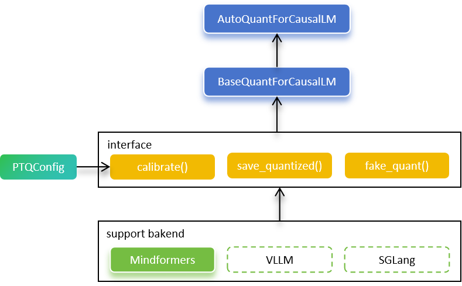
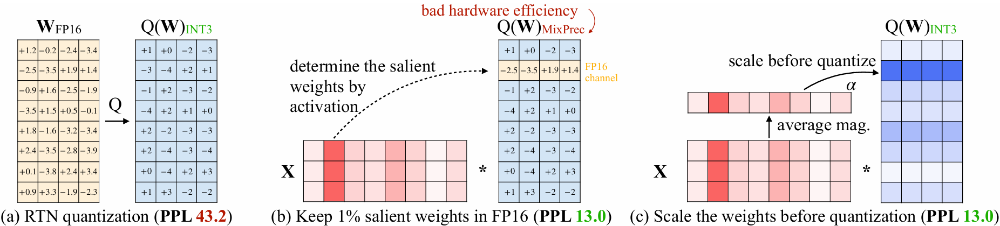
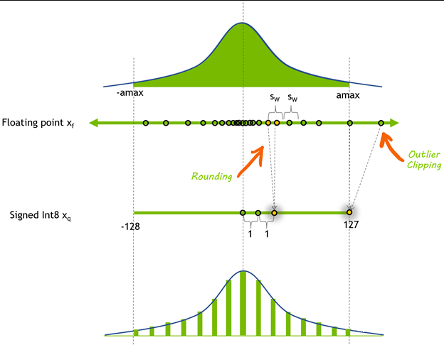

# Applying the PTQ Algorithm

[](https://gitee.com/mindspore/golden-stick/blob/master/mindspore_gs/ptq/ptq/README.md)

[查看中文](./README_CN.md)

## Introduction to the PTQ Algorithm

### Overall Pipeline

The Golden Stick PTQ toolkit delivers state-of-the-art (SOTA) post-training quantization (PTQ) for large language models (LLMs) running on Ascend hardware.

In addition, the MindSpore team and Huawei Taylor Lab have co-developed several algorithmic innovations on top of MindSpore to enable Ascend-friendly, e.g. automatically-tuned mixed-precision quantization; these enhancements are also integrated into Golden Stick.



The Golden Stick exposes two user-facing APIs AutoQuantForCausalLM and BaseQuantForCausalLM that make LLM PTQ on Ascend straightforward.

AutoQuantForCausalLM inspects the pretrained model, selects the appropriate quantized-model implementation, and returns a BaseQuantForCausalLM instance that can be calibrated or evaluated.

BaseQuantForCausalLM is an abstract interface that allows different front-ends (MindSpore Transformers, vLLM, SGLang, etc.) to plug in the same quantization algorithms; at present only MindSpore Transformers is fully supported, while native vLLM support is under active development.

To maximize accuracy across diverse model architectures, BaseQuantForCausalLM accepts a PTQConfig that specifies quantization policies on a per-layer basis.Currently supported algorithms include OutlierSuppressionLite (OSL), SmoothQuant, A8W4, AWQ, GPTQ, KV-Cache-INT8, and RTN, any of which can be applied selectively to different layers.

Finally, BaseQuantForCausalLM provides a save_quantized() method that exports the quantized weights directly in Hugging Face format for immediate deployment.

### Support Range

Table 1: PTQ algorithm specifications

| Specifications | Specification Descriptions |
| --- | --- |
| Hardware Support | Atlas 800I A2 |
| Network Support | DeepSeekV3/R1 <br> Qwen3 <br> Qwen3-moe <br> Telechat2 <br> For details, refer to [MindSpore Transformers Mcore Network](https://gitee.com/mindspore/mindformers/blob/master/mindformers/parallel_core/inference/base_models/gpt/gpt_model.py#L38). |
| Operation Mode Support | The quantization checkpoint phase supports only PyNative mode, and the quantization inference phase is not limited to modes, suggesting GraphMode for better performance. |

> The current calibrate API relies on the base GPTModel provided by MindSpore Transformers for network-topology analysis; support for models from other frameworks is under active development.

### Algorithmic Support

Post-training quantization algorithms have many kinds of classification dimensions, such as static quantization and dynamic quantization; weight quantization, activation quantization, and KVCache quantization; MinMax quantization, MSE quantization, KL scatter quantization, and histogram quantization; as well as a variety of quantization optimization techniques, ranging from the simplest rounding quantization to SmoothQuant quantization, GPTQ quantization, AWQ quantization, and so on.

This subsection describes the capabilities of the PTQ algorithm in terms of common quantization algorithm paradigms in the industry, before giving some limitations on other categorization dimensions:

- Only MinMax quantization is supported.
- Activation quantization: static per-tensor and dynamic per-token schemes are supported.
- Weight quantization: per-channel and per-group schemes are supported.
- KVCache quantization: static per-channel and dynamic per-token schemes are supported.
- For full quantization, per-channel activation is not yet supported owing to hardware/operator limitations, and weight quantization with non-zero zero-point is not supported.
- Although the hardware can handle weights with arbitrary zero-points, the current PTQ implementation does not expose this capability; only zero-point-free weight quantization is available.
- Due to limitations in MindSpore’s low-level quantized operators, the current Golden Stick PTQ algorithms are only enabled for a subset of MindSpore Transformers layers: [MindSpore Transformers Linear layers](https://gitee.com/mindspore/mindformers/blob/master/mindformers/parallel_core/inference/tensor_parallel/layers.py) and [MindSpore Transformers MoE layers](https://gitee.com/mindspore/mindformers/blob/master/mindformers/parallel_core/inference/tensor_parallel/grouped_layers.py) support both activation and weight quantization. [MindSpore Transformers PageAttention layers](https://gitee.com/mindspore/mindformers/blob/master/mindformers/modules/paged_attention_mgr.py) support KVCache quantization. If the user needs to quantize the network that is not based on MindSpore Transformers, the user is required to provide the relevant quantization operator implementation, the current customization capability in this regard does not form a clear interface, will be provided in the future.

The list of quantization algorithms already supported by Golden Stick:

| Supported Algorithm | Brief Description
|-------|-------|
| [OutlierSuppressionLite](#outliersuppressionlite-algorithm) | Co-developed by Huawei Taylor Lab and the MindSpore team; searches for the optimal α hyper-parameter for every matrix on top of SmoothQuant.
| [A8W4 Quantization](#golden-stick-supports-combination-quantization) | A layer-wise mixed-precision method from MindSpore team; activations are quantized to 8-bit dynamic per-token, weights to 4-bit per-group GPTQ.
| [SmoothQuant](#smoothquant-algorithm) | A8W8 quantization that migrates the quantization difficulty from activations to weights via smooth-scaling.
| [GPTQ](#gptq-algorithm) | Quantizes all parameters inside a block one-by-one to compensate for the accuracy drop caused by quantization.
| [dynamic quantization](#dynamic-quantization-algorithm) | Applies dynamic per-token quantization to activations or KVCache.
| [AWQ](#awq-algorithm) | Achieves low-bit weight quantization through offline grid-search.
| [RoundToNearest(RTN)](#roundtonearest-algorithm) | A naive post-training method that rounds values to the nearest integer.

#### SmoothQuant Algorithm

It is found that, unlike CNNs and small transformer networks, when the number of parameters of the large language model exceeds 6.8B, "systematic outliers with large magnitude" appear in the activation of the network, which is difficult to quantify due to the wide and heterogeneous distribution of floating points.


The [SmoothQuant](https://arxiv.org/pdf/2211.10438) algorithm transfers a portion of the outliers on the activations to the weights through a mathematically equivalent transformation, thus transforming the difficult-to-quantify activations and very easy-to-quantify weights into easy-to-quantify activations and easy-to-quantify weights, and realizing the improvement of quantization accuracy.

User can enable the SmoothQuant capability of PTQ with the following configuration item:

```python
from mindspore import dtype as msdtype
from mindspore_gs.ptq import PTQConfig, OutliersSuppressionType

ptq_config = PTQConfig(weight_quant_dtype=msdtype.int8, act_quant_dtype=msdtype.int8,
                       outliers_suppression=OutliersSuppressionType.SMOOTH)
```

#### OutlierSuppressionLite Algorithm

OutlierSuppressionLite (OSL) is a grid-search-based algorithm co-developed by Huawei Taylor Lab and the MindSpore team. It further boosts the accuracy of static quantization and will be referred to as OSL hereafter.

OSL (OutlierSuppressionLite) is a streamlined variant of the [OutlierSuppressionPlus](https://arxiv.org/abs/2304.09145) algorithm. Building on [SmoothQuant](https://arxiv.org/pdf/2211.10438), it performs a grid search over the migration-strength hyper-parameter α, finding the optimal α for every single matrix in the network.
This finer-grained tuning better suppresses activation outliers and thereby boosts the accuracy of the quantized model.

> [SmoothQuant](https://arxiv.org/pdf/2211.10438) algorithm migrates the quantization difficulty from activations to weights, and introduces a hyper-parameter, migration strength α, to control how much difficulty is migrated. Through whole-model experiments, the paper found that α = 0.5 is the well-balanced point for most models. However, different network structures, different positions of decoder layers, and different positions of matrices within decoder layers can lead to different distributions of activation values and weights, thereby resulting in different optimal values of α.

User can enable the OutlierSuppressionLite capability of PTQ with the following configuration item:

```python
from mindspore import dtype as msdtype
from mindspore_gs.ptq import PTQConfig, OutliersSuppressionType

ptq_config = PTQConfig(weight_quant_dtype=msdtype.int8, act_quant_dtype=msdtype.int8,
                       outliers_suppression=OutliersSuppressionType.OUTLIER_SUPPRESSION_LITE)
```

#### GPTQ Algorithm

The [GPTQ](https://arxiv.org/abs/2210.17323) (Gradient-based Post-training Quantization) algorithm is a step-by-step evolution of the OBD, OBS, OBC (OBQ) algorithm, and the GPTQ algorithm is an accelerated version of the OBQ algorithm.
The core idea of the GPTQ algorithm is to quantize all weights in a block one by one, and after each weight is quantized, other unquantified weights in the block need to be appropriately adjusted to make up for the loss of accuracy caused by quantization.


The PTQ algorithm supports the use of the GPTQ algorithm for 8-bit and 4-bit weight quantization and has incorporated it into the set of accuracy recovery algorithms. Currently, GPTQ is the only optional algorithm for accuracy recovery.
The GPTQ algorithm supports per_group and per_channel quantization, and you can enable the per_channel quantization of the GPTQ algorithm through the following configuration items:

```python
from mindspore import dtype as msdtype
from mindspore_gs.ptq import PTQConfig, OutliersSuppressionType, PrecisionRecovery, QuantGranularity
from mindspore_gs.ptq.ptq_config import GPTQQuantConfig

algorithm_config = GPTQQuantConfig(desc_act=False, static_groups=False, damp_percent=0.1, block_size=128)
ptq_config = PTQConfig(weight_quant_dtype=msdtype.qint4x2, act_quant_dtype=None, kvcache_quant_dtype=None,
                       outliers_suppression=OutliersSuppressionType.NONE, algo_args=algorithm_config,
                       weight_quant_granularity=QuantGranularity.PER_CHANNEL, group_size=0,
                       precision_recovery = PrecisionRecovery.GPTQ)
```

You can enable the per_group quantization of the GPTQ algorithm through the following configuration items:

```python
from mindspore import dtype as msdtype
from mindspore_gs.ptq import PTQConfig, OutliersSuppressionType, PrecisionRecovery, QuantGranularity
from mindspore_gs.ptq.ptq_config import GPTQQuantConfig

algorithm_config = GPTQQuantConfig(desc_act=False, static_groups=False, damp_percent=0.1, block_size=128)
ptq_config = PTQConfig(weight_quant_dtype=msdtype.qint4x2, act_quant_dtype=None, kvcache_quant_dtype=None,
                       outliers_suppression=OutliersSuppressionType.NONE, algo_args=algorithm_config,
                       weight_quant_granularity=QuantGranularity.PER_GROUP, group_size=128,
                       precision_recovery = PrecisionRecovery.GPTQ)
```

#### Dynamic Quantization Algorithm

Currently, the Golden Stick supports only per-token dynamic quantization. The per-token quantization algorithm refers to the allocation of independent quantization parameters for each token to minimize errors. Dynamic quantization implies that the quantization parameters are computed in real time during the inference phase, without the need for offline calculation of quantization parameters.

per-token dynamic quantization algorithm is to execute per-token online quantization of activation or KVcache in the process of inference, and calculate the scale and zp of token dimension online without using dataset for calibration quantization, which is more accurate than offline static quantization. Currently, per-token dynamic quantization supports only symmetric quantization.

1. Activation per-token Dynamic Quantization

For activation per-token dynamic quantization, RoundToNearest quantization of weights is required first, and then we can use quantized weights to perform W8A8-per-token inference. per-token dynamic quantization with activation also supports smooth operation, so smooth parameters can be calculated during the quantization process.

- Activation per-token Dynamic Quantization With Smooth Parameter

    If you want to include the smooth parameter, the corresponding configuration items are as follows.

    ```python
    from mindspore import dtype as msdtype
    from mindspore_gs.ptq.ptq_config import PTQConfig, OutliersSuppressionType, QuantGranularity

    ptq_config = PTQConfig(weight_quant_dtype=msdtype.int8, act_quant_dtype=msdtype.int8, weight_quant_granularity=QuantGranularity.PER_TOKEN,
                           outliers_suppression=OutliersSuppressionType.SMOOTH)
    ```

    At this time, the corresponding calculation formula for activation is as follows:

    $$scale = \frac{row\_max(abs(X_{float} \cdot smooth\_scale))} {127}$$

    $$x_{int} = round(x_{float} \div scale)$$

- Activation per-token Dynamic Quantization Without Smooth Parameter

    If the smooth parameter is not included, the corresponding configuration items are as follows.

    ```python
    from mindspore import dtype as msdtype
    from mindspore_gs.ptq.ptq_config import PTQConfig, OutliersSuppressionType, QuantGranularity

    ptq_config = PTQConfig(weight_quant_dtype=msdtype.int8, act_quant_dtype=msdtype.int8,
                           weight_quant_granularity=QuantGranularity.PER_TOKEN,
                           outliers_suppression=OutliersSuppressionType.NONE)
    ```

    At this time, the corresponding calculation formula for activation is as follows:

    $$scale = \frac{row\_max(abs(X_{{float}}))} {127}$$

    $$x_{int} = round(x_{float} \div scale)$$

W8A8-per-token inference can also be carried out directly using w8a16 quantized weight of PTQ algorithm.

2. KVCache per-token Dynamic Quantization

per-token dynamic quantization of KVCache, without offline quantization operation, can be directly passed in the original floating point weight for direct inference. The corresponding configuration items are as follows:

```python
from mindspore import dtype as msdtype
from mindspore_gs.ptq.ptq_config import PTQConfig, OutliersSuppressionType, QuantGranularity

ptq_config = PTQConfig(weight_quant_dtype=None, act_quant_dtype=None,
                       kvcache_quant_dtype=msdtype.int8,
                       kvcache_quant_granularity=QuantGranularity.PER_TOKEN,
                       outliers_suppression=OutliersSuppressionType.NONE)
```

At this time, the corresponding calculation formula for KVCache is as follows:

$$scale = \frac{row\_max(abs(KVCache_{{float}}))} {127}$$

$$KVCache_{int} = round(KVCache_{float} \div scale)$$

> Since the ParallelLlamaForCausalLM network in MindSpore Transformers has been deprecated, in MindSpore Golden Stick version 1.2.0, this network does not support KVCache Int8 quantization. Future versions will support KVCache Int8 quantization on a new network.

#### AWQ Algorithm

The [Research](https://arxiv.org/pdf/2306.00978) finds that weights are not equally important for LLMs’ performance. There is a small fraction (0.1%-1%) of weights called salient weights which are significantly important to LLMs’ performance. Skipping the quantization of these salient weights while quantization other weights to low bits can archive dramatically reducation of LLM inference memory footprint with low quantization accuracy loss.



In [Activation-Aware Weight Quantization, AWQ](https://arxiv.org/pdf/2306.00978), the salient weights are selected based on the distribution of activation values, and considering the hardware efficiency, the salient weights are protected by scaling to avoid the same weight tensor from being stored by different data types, so as to realize the hardware-friendly and high-precision weighting algorithm, which can realize the quantization to 4bits or even lower bits. In addition to the protection of significant weights, AWQ also introduces dynamic weight truncation technology to further improve the accuracy of quantization.

MindSpore Golden Stick supports AWQ by adding an `OutliersSuppressionType` method called `OutliersSuppressionType.AWQ`, which is currently only supported the [ParallelLlamaForCausalLM network](https://gitee.com/mindspore/mindformers/blob/master/research/llama3_1/llama.py).

AWQ algorithm supports both PerChannel quantization and PerGroup quantization, and user can enable the PerChannel AWQ algorithm of PTQ by using the following configuration items:

```python
from mindspore import dtype as msdtype
from mindspore_gs.ptq import PTQConfig, OutliersSuppressionType

ptq_config = PTQConfig(weight_quant_dtype=msdtype.qint4x2, act_quant_dtype=None, kvcache_quant_dtype=None,
                       outliers_suppression=OutliersSuppressionType.AWQ)
```

or：

```python
from mindspore import dtype as msdtype
from mindspore_gs.ptq import PTQConfig, OutliersSuppressionType, QuantGranularity

ptq_config = PTQConfig(weight_quant_dtype=msdtype.qint4x2, act_quant_dtype=None, kvcache_quant_dtype=None,
                       outliers_suppression=OutliersSuppressionType.AWQ,
                       weight_quant_granularity=QuantGranularity.PER_CHANNEL, group_size=0)
```

User can enable the PerGroup AWQ algorithm of PTQ by using the following configuration items:

```python
from mindspore import dtype as msdtype
from mindspore_gs.ptq import PTQConfig, OutliersSuppressionType, QuantGranularity

ptq_config = PTQConfig(weight_quant_dtype=msdtype.qint4x2, act_quant_dtype=None, kvcache_quant_dtype=None,
                       outliers_suppression=OutliersSuppressionType.AWQ,
                       weight_quant_granularity=QuantGranularity.PER_GROUP, group_size=128)
```

> Considering the inference performance of PerGroup quantization on the Ascend hardware, it is recommended to set the group_size to 64 or 128.

At the same time, AWQConfig can be used to specify the hyperparameter search range of AWQ:

```python
from mindspore import dtype as msdtype
from mindspore_gs.ptq import PTQConfig, OutliersSuppressionType, QuantGranularity, AWQConfig

awq_config = AWQConfig(duo_scaling=False, smooth_alpha=[0.5, 0.7, 0.9], weight_clip_ratio=[0.90, 0.95, 0.99])
ptq_config = PTQConfig(weight_quant_dtype=msdtype.qint4x2, act_quant_dtype=None, kvcache_quant_dtype=None,
                       outliers_suppression=OutliersSuppressionType.AWQ,
                       weight_quant_granularity=QuantGranularity.PER_GROUP, group_size=128, algo_args=awq_config)
```

#### RoundToNearest Algorithm

RoundToNearest algorithm is a class of plainer post-quantization algorithms, which use Round to nearest, i.e. rounding, hence the name RoundToNearest. The algorithm capability is similar to the independent [RoundToNearest](../round_to_nearest/README.md) algorithm capability by Golden Stick, which will stop evolving the RoundToNearest algorithm and use the PTQ algorithm to support the RoundToNearest algorithm capability.

The main logic of the quantization algorithm is to calculate the quantization parameters based on floating point data such as the maximum and minimum values of weights and the maximum and minimum values of integer data according to the formula:

$$scale = \frac{X_{{float}_{max}} - {X_{float}}_{min}} {X_{{int}_{max}} - {X_{int}}_{min}}$$

$$offset = round(X_{{int}_{max}} - \frac{X_{{float}_{max}}} {scale})$$

Where scale is the scaling factor and offset is the translation factor, both collectively known as quantization parameters. After obtaining the quantization parameters, the weights can be quantized:

$$x_{int} = clamp(round(x_{float} \div scale) + offset; 0, 2^b-1)$$

RoundToNearest algorithm applies the above quantization process to the weight matrix in the network by converting it to 8bit integer for storage. After loading the 8bit weights at deployment time, they are inversely quantized and the mathematical expression of the process is as follows:

$$X_{float} = (X_{int} - offset) \times scale$$

After inverse quantization of weights to floating point, the inference process of the network is no different from the general floating point network inference process. Weight quantization does not bring about a reduction in computation, on the contrary, inverse quantization will bring about additional computation, so the operation of inverse quantization is usually fused with the subsequent floating point computation process, which can effectively reduce the memory overhead in the deployment phase, and at the same time alleviate the Memory Bound in the incremental inference phase of the large language model, which both can improve the throughput of the large language model when deployed.



PTQ RoundToNearest Algorithm currently supports only 8bit weight quantization capability, which can be enabled by the following configuration item:

```python
from mindspore import dtype as msdtype
from mindspore_gs.ptq import PTQConfig, OutliersSuppressionType

ptq_config = PTQConfig(weight_quant_dtype=msdtype.int8,  act_quant_dtype=None,  kvcache_quant_dtype=None,
                       outliers_suppression=OutliersSuppressionType.NONE)
```

#### Golden Stick supports combination quantization

1. AxWx quantization combined with KV-Cache quantization

Thanks to the layered decoupling framework design, the PTQ algorithm can easily combine different algorithmic capabilities:

- 8bit weight quantization combined with 8bit KVCache quantization:

    ```python
    from mindspore import dtype as msdtype
    from mindspore_gs.ptq import PTQConfig, OutliersSuppressionType

    ptq_config = PTQConfig(weight_quant_dtype=msdtype.int8, act_quant_dtype=None, kvcache_quant_dtype=msdtype.int8,
                           outliers_suppression=OutliersSuppressionType.NONE)
    ```

- SmoothQuant quantization combined with 8bit KVCache quantization:

    ```python
    from mindspore import dtype as msdtype
    from mindspore_gs.ptq import PTQConfig, OutliersSuppressionType

    ptq_config = PTQConfig(weight_quant_dtype=msdtype.int8, act_quant_dtype=msdtype.int8, kvcache_quant_dtype=msdtype.int8,
                           outliers_suppression=OutliersSuppressionType.SMOOTH)
    ```

2. Layer-wise combination Quantization – A8W4

Golden Stick also lets you assign a different quantization policy to each layer, A8W4 is one such composite recipe.

Taking the DeepSeek-V3/R1 network as an example, attention blocks are quantized with OSL, dense feed-forward blocks use dynamic A8W8, moe blocks use dynamic A8W4.

Because of current operator constraints, only moe layers can be quantized with A8W4. The moe structure is defined here[moe block](https://gitee.com/mindspore/mindformers/blob/master/mindformers/parallel_core/inference/transformer/moe/moe_layer.py#L100).

Inside an moe block, activations are quantized with dynamic 8-bit per-token, while weights are compressed to 4-bit via per-group GPTQ.

On DeepSeek-R1 this recipe yields 70% weight-size reduction, fits the model on a single server, and keeps accuracy drop within 1% on the evaluation set.

The corresponding PTQConfig snippet is shown below.

```python
from mindspore import dtype as msdtype
from mindspore_gs.ptq import (PTQConfig, PTQMode, BackendTarget,
                              QuantGranularity, PrecisionRecovery,
                              GPTQQuantConfig)

gptq_config = GPTQQuantConfig(static_groups=True, desc_act=True)
ptq_config = PTQConfig(mode=PTQMode.QUANTIZE, backend=BackendTarget.ASCEND,
                            weight_quant_dtype=msdtype.qint4x2, act_quant_dtype=msdtype.int8,
                            weight_quant_granularity=QuantGranularity.PER_GROUP,
                            group_size=64, algo_args=gptq_config,
                            act_quant_granularity=QuantGranularity.PER_TOKEN,
                            precision_recovery=PrecisionRecovery.GPTQ)
```

Note:

1) The priority of parameter configurations in layer_policies is higher than that of net_policy. If a layer matches the layer_policies configuration, this policy is used preferentially. Otherwise, use the net_policy policy.

2) The mode and backend parameters in PTQConfig are subject to net_policy.

3) At present, the configuration policy can only be set manually based on heuristics; automatic generation is on the roadmap.

## Samples

The application of the PTQ algorithm can be divided into two main phases: the quantization phase and the deployment phase.

The quantization phase is collecting the distribution of weights, calculating the quantization parameters, quantizing the weight data, and inserting the anti-quantization nodes.

The deployment phase is typically the process of inference about the quantized model in a production environment, using the MindSpore framework.

### Qwen3-0.6B Mixed-Precision Quantization

This use case is demonstrated using the Qwen3 network in four main steps: environment preparation, model quantification, model deployment evaluation, and effect analysis.

#### Step 1. Environment Preparation

1.1. Ascend Environment

The PTQ algorithm needs to run on Ascend hardware, and the environment configuration of Ascend can be found in the Installing Ascend AI processor software package and Configuring Environment Variables subsection in [MindSpore Installation Guide](https://www.mindspore.cn/install/en).

1.2. MindSpore Environment

Golden Stick relies on MindSpore, and you need to install the proper MindSpore in advance. You can download the pre-compiled package from the [MindSpore official website](https://www.mindspore.cn/versions/en) and install it.

1.3. MindSpore Transformers Environment

This sample quantizes and reasons about networks in MindSpore Transformers, so you need to install the appropriate MindSpore Transformers in advance. You can download the pre-compiled package from the [MindSpore official website](https://www.mindspore.cn/versions/en) and install it.

1.4. Preparation of Relevant Documents

**Step 1** Create a working directory:

```shell
mkdir workspace
```

**Step 2** Download the CEval dataset manually and copy the resulting dataset CEval to the workspace directory:

Dataset download address: [CEval dataset](https://huggingface.co/ceval)

**Step 3** Prepare the checkpoint file for the Qwen3-0.6B network. Due to permission restrictions, manual download is required.

Download address: [Qwen3-0.6B](https://huggingface.co/Qwen/Qwen3-0.6B)

After downloading, copy them to the workspace directory.

**Step 4** Download Qwen3 network yaml file:

Download address:：[predict_qwen3.yaml](https://gitee.com/mindspore/mindformers/blob/master/configs/qwen3/predict_qwen3.yaml)

After downloading, copy yaml file to the workspace directory.

**Step 5** Navigate to the workspace, download the Golden Stick source code, and install it from source:

```python
git clone https://gitee.com/mindspore/golden-stick.git

cd golden-stick
pip install -e .
```

After preparing the above files, the directory structure is:

```shell
workspace
  └── ceval
  └── predict_qwen3.yaml
  └── Qwen3-0.6B
  └── golden-stick
```

#### Step 2. Model Quantization

2.1. Edit the YAML file

1. In predict_qwen3.yaml, set both `load_checkpoint` and `pretrained_model_dir` to the path where the Qwen3-0.6B weights are stored.

2. If you want to run quantization calibration on multiple devices, change `use_parallel` to True and set `model_parallel` to the number of cards.

3. Change `mode` to 1 to perform calibration in dynamic-graph mode.

After these edits, you can use AutoQuantForCausalLM of Golden Stick to build the network from the config file and load the checkpoint in one line:

```python
from mindspore_gs.ptq.models import AutoQuantForCausalLM

config_path = '/path/to/workspace/predict_qwen3.yaml'
model = AutoQuantForCausalLM.from_pretrained(config_path)
```

2.2 Build the Calibration Dataset

We can use the CEval dataset to calibrate model, in practice only a few hundred samples are needed. In this example we load 200 samples by setting n_samples=200:

```python
from mindspore_gs.datasets import get_datasets

ds_path = '/path/to/workspace/squad/train-v1.1.json'
bs_ = helper.get_spec('batch_size')
seq_ = helper.get_spec('seq_length')
max_decode_length = helper.get_spec('max_decode_length')
ignore_token_id = helper.get_spec('ignore_token_id')
tokenizer = helper.create_tokenizer()
ds = get_datasets('squad1.1', ds_path, "train", bs_, seq_, max_decode_length, tokenizer, ignore_token_id, 1,
                  False, n_samples=200)
```

2.3. Create the Calibration Strategy and Run Model Calibration

We enable different quantization configuration through a PTQConfig; see the [API doc](https://www.mindspore.cn/golden_stick/docs/zh-CN/master/ptq/mindspore_gs.ptq.PTQConfig.html#mindspore_gs.ptq.PTQConfig) for details.

Below is an example of layer-wise mixed-precision calibration:

1. Attention blocks in layers 0–9: calibrated with OSL.

2. Attention blocks in layers 10–19: calibrated with SmoothQuant.

3. All feed-forward blocks in the network: calibrated with dynamic A8W8.

```python
from collections import OrderedDict
from mindspore import dtype as msdtype
from mindspore_gs.common import BackendTarget
from mindspore_gs.ptq import (PTQConfig, PTQMode,
                              OutliersSuppressionType,
                              QuantGranularity)

a8w8_dynamic_cfg = PTQConfig(mode=PTQMode.QUANTIZE, backend=BackendTarget.ASCEND,
                             weight_quant_dtype=msdtype.int8, act_quant_dtype=msdtype.int8,
                             act_quant_granularity=QuantGranularity.PER_TOKEN,
                             opname_blacklist=['output_layer'])
smoothquant_cfg = PTQConfig(mode=PTQMode.QUANTIZE, backend=BackendTarget.ASCEND,
                            weight_quant_dtype=msdtype.int8, act_quant_dtype=msdtype.int8,
                            act_quant_granularity=QuantGranularity.PER_TENSOR,
                            outliers_suppression=OutliersSuppressionType.SMOOTH,
                            opname_blacklist=['output_layer', 'linear_fc2'])
osl_cfg = PTQConfig(mode=PTQMode.QUANTIZE, backend=BackendTarget.ASCEND,
                    weight_quant_dtype=msdtype.int8, act_quant_dtype=msdtype.int8,
                    act_quant_granularity=QuantGranularity.PER_TENSOR,
                    outliers_suppression=OutliersSuppressionType.OUTLIER_SUPPRESSION_LITE,
                    opname_blacklist=['output_layer', 'linear_fc2'])
cfg = a8w8_dynamic_cfg
layer_policies = OrderedDict({r'.*\.[0-9]\.self_attention.*': osl_cfg,
                              r'.*\.1[0-9]\.self_attention.*': smoothquant_cfg,
                              })
```

With the PTQConfig ready, we can now perform model quantization calibration via the calibrate method:

> For the Qwen3 network some layers are sensitive to quantization and should be skipped; we usually list them in the opname_blacklist field of PTQConfig to exclude them from quantization.

```python
model.calibrate(cfg, layer_policies, datasets)
```

2.4 Saving the Quantized Network

Next, use the save_quantized() interface to persist the calibrated quantized network:

```python
output_dir = "./output/Qwen3-mix-quant"
model.save_quantized(output_dir)
```

After successful completion, the quantized weight files and the quantization-strategy description file will be saved under `./output/Qwen3-mix-quant`.

The resulting directory structure should look like:

```shell
Qwen3-mix-quant
  └── config.json
  └── generation_config.json
  └── model.safetensors.index.json
  └── quant-model-00001-of-00001.safetensors
  └── quantization_description.json
  └── tokenizer_config.json
  └── vocab.json
```
