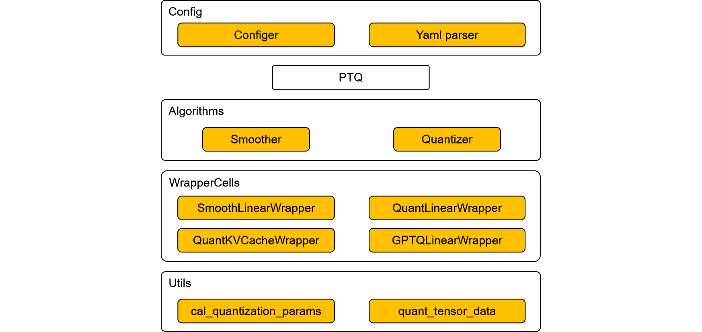

# 应用PTQ算法

[View English](./README.md)

## PTQ算法简介

### 设计初衷

为了实现组合量化算法，以及后续金箍棒对于混合精度量化、自动搜优等复杂量化算法的支持，金箍棒引入名为PTQ的训练后量化算法。该算法依赖于MindSpore前端并行能力，得以实现更加复杂的算法实现逻辑。

该算法能够提供RoundToNearest和SmoothQuant两个量化算法的能力，后续新的训练后量化算法也会在此算法上演进，所以我们将该算法命名为PTQ。

### 设计思路



分层实现量化算法，主要分为config、量化算法、算法模块、量化Cell、量化工具函数。

- config主要用于用户配置算法。并且实现yaml序列化反序列化能力。
- 量化算法是算法的主入口，PTQ算法同样继承自金箍棒算法基类CompAlgo，实现了apply和convert接口，分别实现量化checkpoint和量化部署网络导出的功能。
- 算法模块是一些模块化的功能块，比如本次PTQ算法中内置了针对Linear层的Smooth模块，针对Linear和KVCache层的量化模块。通过这些模块的组装，可以实现各种算法，比如SmoothQuant算法。这保证了PTQ算法高度的扩展性和灵活性。
- 量化Cell是针对特定的非量化网络层，封装得到的量化网络层，用于实现对特定网络层的量化。量化网络层通过注册方式引入，实现了不同网络框架之间的解耦，比如金箍棒和MindFormers解耦。
- 量化工具函数是一些基础的工具函数，如量化参数的计算，矩阵的量化等。

### 支持范围

表1：PTQ算法规格

| 规格 | 规格说明 |
| --- | --- |
| 硬件支持 | Atlas 800I A2 |
| 网络支持 | ParallelLlamaForCausalLM，具体请参见[ParallelLlamaForCausalLM网络](https://gitee.com/mindspore/mindformers/blob/dev/mindformers/experimental/infer/models/llama/llama.py) |
| 运行模式支持 | 量化checkpoint阶段仅支持PyNative模式，量化推理阶段不限定模式，建议GraphMode获得更好的性能 |

> 当前PTQ算法依赖于完整的DecoderLayer做网络拓扑分析，所以不支持任意基于MindFormers的Linear层构造的网络，我们计划在后续版本改进这一点，以提升PTQ算法的网络泛化能力。

## 示例

跟金箍棒所有算法一样，PTQ算法的应用主要可以分为两个阶段：量化阶段和部署阶段。

量化阶段是部署前提前完成的，主要的工作是：收集权重的分布、计算量化参数、量化权重数据、插入反量化节点。

部署阶段通常是指在生产环境，使用MindSpore框架对量化后的模型进行推理的过程。

本用例使用ParallelLlamaForCausalLM 7B网络进行演示，主要分四个步骤：环境准备、模型量化、模型部署评估、效果分析。

### 步骤1. 环境准备

#### 1.1. Ascend环境

PTQ算法需要运行在Ascend硬件上，Ascend的环境配置可以参考[MindSpore安装指南](https://www.mindspore.cn/install)安装昇腾AI处理器配套软件包小节和配置环境变量小节。

#### 1.2. MindSpore环境

金箍棒依赖于MindSpore，需要提前安装合适的MindSpore。可以从MindSpore官网下载预编译好的[v2.4.0版本安装包](https://www.mindspore.cn/versions)并安装。

#### 1.3. MindFormers环境

本样例对MindFormers中的网络进行量化并推理，所以需要提前安装合适的MindFormers。可以从MindSpore官网下载预编译好的[v1.3.0版本安装包](https://www.mindspore.cn/versions)并安装。

#### 1.4. 金箍棒环境

从MindSpore官网下载预编译好的[MindSpore GoldenStick v0.6.0 版本安装包](https://www.mindspore.cn/versions)并安装。

#### 1.5. 相关文件准备

需要预先下载[squad1.1数据集](https://data.deepai.org/squad1.1.zip)、[Llama2 7B预训练权重](https://ascend-repo-modelzoo.obs.cn-east-2.myhuaweicloud.com/MindFormers/llama2/llama2_7b.ckpt)和[Llama2分词器文件](https://ascend-repo-modelzoo.obs.cn-east-2.myhuaweicloud.com/MindFormers/llama2/tokenizer.model)。

**第一步**创建工作目录：

```shell
mkdir workspace
```

**第二步**准备数据集，由于权限限制，需要手动下载squad数据集：

数据集下载地址：[squad1.1数据集](https://data.deepai.org/squad1.1.zip)

下载完成后，将得到的数据集squad1.1.zip拷贝至第一步创建的workspace目录下，并确保数据集名称为squad1.1.zip，然后运行解压代码：

```shell
cd workspace
unzip squad1.1.zip -d ./squad
```

使用unzip命令解压squad1.1.zip文件后，可以得到train-v1.1.json和dev-v1.1.json量化数据集文件，我们先使用train数据集进行量化校准，然后使用dev数据集进行量化评测。

**第三步**准备Llama2 7b网络的checkpoint文件，Llama2分词器文件，Llama2模型配置文件：

下载地址：

[Llama2 7b checkpoint](https://ascend-repo-modelzoo.obs.cn-east-2.myhuaweicloud.com/MindFormers/llama2/llama2_7b.ckpt)

[Llama2分词器文件](https://ascend-repo-modelzoo.obs.cn-east-2.myhuaweicloud.com/MindFormers/llama2/tokenizer.model)

[llama2模型配置文件](https://gitee.com/mindspore/mindformers/blob/dev/configs/llama2/predict_llama2_7b.yaml)

下载好上述3个文件后，将其拷贝至workspace目录下。

准备完上述文件后，目录结构为：

```shell
workspace
  ├── squad
  ├     ├── train-v1.1.json
  ├     └── dev-v1.1.json
  ├── predict_llama2_7b.yaml
  ├── tokenizer.model
  └── llama2_7b.ckpt
```

### 步骤2. 模型量化

#### 2.1. 构造非量化网络

构造MindFormers仓的ParallelLlamaForCausalLM 7B网络，首先需要修改predict_llama2_7b.yaml文件的如下内容：

1. 更新load_checkpoint字段为llama2_7b.ckpt所在路径。

2. 更新process中的vocab_file字段为tokenizer.model所在路径。没有该字段的话，可手动添加。

3. 修改context中的device_id为当前机器空闲的设备id，context中的mode为1，即PYNATIVE模式。

4. 修改model.arch.type字段为ParallelLlamaForCausalLM。

5. 修改use_parallel为True, parallel.parallel_mode为3，parallel_config.data_parallel为1。

修改完成后，可以使用金箍棒提供的MFParallelLlama2Helper方便地通过配置文件构造网络并加载checkpoint，代码如下：

```python
from mindspore_gs.ptq.network_helpers.mf_net_helpers import MFParallelLlama2Helper

config_path = '/path/to/workspace/predict_llama2_7b.yaml'
helper = MFParallelLlama2Helper(config_path)
network = helper.create_network()
```

#### 2.2. 构造squad-v1.1数据集loader

我们基于squad的train-v1.1.json进行量化过程中的校准，用mindspore_gs的get_datasets接口构造squad-v1.1数据集loader。

一般量化校准阶段只会使用数百条数据进行校准，当前样例中，我们使用n_samples参数指定仅加载数据集中的200条数据，代码如下：

```python
from mindspore_gs.datasets import get_datasets

ds_path = '/path/to/workspace/squad/train-v1.1.json'
bs_ = helper.get_spec('batch_size')
seq_ = helper.get_spec('seq_length')
max_decode_length = helper.get_spec('max_decode_length')
ignore_token_id = helper.get_spec('ignore_token_id')
tokenizer = helper.create_tokenizer()
ds = get_datasets('squad1.1', ds_path, "train", bs_, seq_, max_decode_length, tokenizer, ignore_token_id, 1,
                  False, n_samples=200)
```

#### 2.3. 构造量化算法

PTQ算法支持基础的round to nearest方法实现的a16w8权重量化和c8（kvcache int8）算法，也支持smooth-quant方法实现的a8w8算法，同时也支持a16w8权重量化算法和c8算法组合量化算法，smooth-quant和c8组合量化算法。

我们可以根据PTQConfig配置来启用不同的量化能力，PTQConfig的含义可以参考其[API文档](https://www.mindspore.cn/golden_stick/docs/zh-CN/master/ptq/mindspore_gs.ptq.PTQConfig.html#mindspore_gs.ptq.PTQConfig)，这里我们展示这几种算法的配置样例：

- a16w8权重量化

    ```python
    from mindspore import dtype as msdtype
    from mindspore_gs.ptq import PTQConfig, OutliersSuppressionType

    ptq_config = PTQConfig(weight_quant_dtype=msdtype.int8,  act_quant_dtype=None,  kvcache_quant_dtype=None,
                        outliers_suppression=OutliersSuppressionType.NONE)
    ```

- smooth-quant量化

    ```python
    from mindspore import dtype as msdtype
    from mindspore_gs.ptq import PTQConfig, OutliersSuppressionType

    ptq_config = PTQConfig(weight_quant_dtype=msdtype.int8, act_quant_dtype=msdtype.int8, kvcache_quant_dtype=None,
                        outliers_suppression=OutliersSuppressionType.SMOOTH)
    ```

- kvcache int8量化

    ```python
    from mindspore import dtype as msdtype
    from mindspore_gs.ptq import PTQConfig, OutliersSuppressionType

    ptq_config = PTQConfig(weight_quant_dtype=None, act_quant_dtype=None, kvcache_quant_dtype=msdtype.int8,
                        outliers_suppression=OutliersSuppressionType.NONE)
    ```

- a16w8权重量化组合kvcache int8量化：

    ```python
    from mindspore import dtype as msdtype
    from mindspore_gs.ptq import PTQConfig, OutliersSuppressionType

    ptq_config = PTQConfig(weight_quant_dtype=msdtype.int8, act_quant_dtype=None, kvcache_quant_dtype=msdtype.int8,
                        outliers_suppression=OutliersSuppressionType.NONE)
    ```

- smooth-quant量化组合kvcache int8量化：

    ```python
    from mindspore import dtype as msdtype
    from mindspore_gs.ptq import PTQConfig, OutliersSuppressionType

    ptq_config = PTQConfig(weight_quant_dtype=msdtype.int8, act_quant_dtype=msdtype.int8, kvcache_quant_dtype=msdtype.int8,
                        outliers_suppression=OutliersSuppressionType.SMOOTH)
    ```

有了PTQConfig以后，接下来构造PTQ算法了，代码如下：

> 对于ParallelLlamaForCausalLM网络，某些层对于量化比较敏感，不适合量化，我们通常通过opname_blacklist字段来帮助跳过这些层的量化。

```python
from mindspore_gs.ptq.ptq import PTQ
from mindspore_gs.common import BackendTarget
from mindspore_gs.ptq import PTQMode, PTQConfig, OutliersSuppressionType

ptq_config = PTQConfig(mode=PTQMode.QUANTIZE, backend=BackendTarget.ASCEND, opname_blacklist=["w2", "lm_head"],
                       weight_quant_dtype=msdtype.int8, act_quant_dtype=msdtype.int8, kvcache_quant_dtype=msdtype.int8)
ptq = PTQ(config=ptq_config)
```

#### 2.4. 量化网络并保存量化checkpoint文件

接下来对网络进行量化矫正，主要分为两个步骤：**第一步**是使用PTQ的apply接口，对网络进行量化矫正；**第二步**是使用PTQ的convert接口，将量化矫正后的网络改造成对应后端的真实量化网络：

```python
import mindspore as ms

ptq.apply(network, helper, ds)
ptq.convert(network)
ms.save_checkpoint(network.parameters_dict(), "a8w8c8.ckpt",
                   choice_func=lambda x: "key_cache" not in x and "value_cache" not in x and "float_weight" not in x)
print("quant checkpoint saved at 'a8w8c8.ckpt'", flush=True)
```

成功运行后，量化后的checkpoint文件会保存在 `/path/to/workspace/a8w8c8.ckpt` 路径下。

需要注意的是样例代码中对多卡做了简化，实际上ParallelLlamaForCausalLM 7B网络必须使用msrun来运行，msrun的使用方式可以参考[msrun使用说明](https://www.mindspore.cn/docs/zh-CN/master/model_train/parallel/msrun_launcher.html)，完整的样例代码可以参考[quant_ckpt.py](https://gitee.com/mindspore/golden-stick/blob/master/example/ptq/quant_ckpt.py)。

### 步骤3. 模型部署

#### 3.1. 评估FP16网络的F1EM指标

使用squad1.1 dev数据集评估ParallelLlamaForCausalLM-7B网络的F1EM指标。完整样例可以参考[eval_squad.py](https://gitee.com/mindspore/golden-stick/blob/master/example/ptq/eval_squad.py)。注意需用msrun运行，msrun的使用方式可以参考[msrun使用说明](https://www.mindspore.cn/docs/zh-CN/master/model_train/parallel/msrun_launcher.html)。

> 评测前请确认yaml配置文件中的load_checkpoint字段已正确配置了非量化的网络checkpoint文件路径:`/path/to/workspace/llama2_7b.ckpt`。并配置context.mode为0，即静态图模式。

```python
import numpy as np
import mindspore as ms
from mindformers.core.metric import EmF1Metric
from mindspore_gs.ptq.network_helpers.mf_net_helpers import MFParallelLlama2Helper
from mindspore_gs.datasets import get_datasets
from mindspore_gs.common import logger

config_path = '/path/to/workspace/predict_llama2_7b.yaml'
helper = MFParallelLlama2Helper(config_path)
network = helper.create_network()

ds_path = '/path/to/workspace/squad/dev-v1.1.json'
bs_ = helper.get_spec('batch_size')
seq_ = helper.get_spec('seq_length')
max_decode_length = helper.get_spec('max_decode_length')
ignore_token_id = helper.get_spec('ignore_token_id')
top_k = helper.get_spec("top_k")
top_p = helper.get_spec("top_p")
do_sample = helper.get_spec("do_sample")
pad_token_id = helper.get_spec("pad_token_id")
tokenizer = helper.create_tokenizer()
ds = get_datasets('squad1.1', ds_path, "eval", bs_, seq_, max_decode_length, tokenizer, ignore_token_id, 1,
                  False, n_samples=1000)

metric = EmF1Metric()
metric.clear()

data_count = 0
total_count = ds.get_dataset_size()
for _, ds_item in enumerate(ds.create_dict_iterator()):
    data_count += 1
    logger.info(f"Dataset count: {data_count}/{total_count}")
    input_ids = ds_item['input_ids'].asnumpy()
    labels = ds_item['labels'].asnumpy()

    valid_length_each_example = []
    for j in range(input_ids.shape[0]):
        # As the nonzero returns the index and we need length
        valid_length_each_example.append(np.max(np.argwhere(input_ids[j] != pad_token_id)) + 1)
    valid_length_each_example = np.array(valid_length_each_example)

    outputs = network.generate(input_ids, do_sample=do_sample, max_length=seq_, top_p=top_p, top_k=top_k, max_new_tokens=200)
    output_ids = []
    for j in range(input_ids.shape[0]):
        output_ids.append(outputs[j][int(valid_length_each_example[j]):])

    pres_str = tokenizer.decode(output_ids, skip_special_tokens=True)
    labels_str = tokenizer.decode(labels, skip_special_tokens=True)
    metric.update(pres_str, labels_str)
metric.eval()
```

#### 3.2. 评估量化后网络的F1EM指标

由于MindSpore当前不支持保存修改后的网络，所以在加载量化ckpt之前，需要先用算法恢复带量化结构的网络，然后再加载checkpoint到网络。

评估脚本逻辑与非量化网络的一致，不过中间增加一步修改网络为量化网络的过程。

> 评测前请确认yaml配置文件中的load_checkpoint字段已经配置了正确的量化的网络checkpoint文件路径: `/path/to/workspace/a8w8c8.ckpt`。

```python
import numpy as np
import mindspore as ms
from mindspore.communication.management import init
from mindformers.core.metric import EmF1Metric
from mindformers import MindFormerConfig, AutoModel
from mindformers.experimental.parallel_core.pynative.parallel_state import initialize_model_parallel
from mindspore_gs.ptq.network_helpers.mf_net_helpers import MFParallelLlama2Helper
from mindspore_gs.datasets import get_datasets
from mindspore_gs.common import logger
from mindspore_gs.ptq.ptq import PTQ
from mindspore_gs.common import BackendTarget
from mindspore_gs.ptq import PTQMode, PTQConfig, OutliersSuppressionType


config_path = '/path/to/workspace/predict_llama2_7b.yaml'
mf_config = MindFormerConfig(config_path)

ms.set_context(mode=mf_config.context.mode, device_target=mf_config.context.device_target,
                jit_config={"jit_level": "O0", "infer_boost": "on"})
init()
initialize_model_parallel(mf_config.parallel_config.model_parallel, order='tp')
network = AutoModel.from_config(mf_config, download_checkpoint=False)
network.set_train(False)
network.phase = 'predict'

ptq_config = PTQConfig(mode=PTQMode.DEPLOY, backend=BackendTarget.ASCEND, opname_blacklist=["w2", "lm_head"],
                       weight_quant_dtype=ms.dtype.int8, act_quant_dtype=ms.dtype.int8, kvcache_quant_dtype=ms.dtype.int8)
ptq = PTQ(config=ptq_config)
ptq.apply(network)
ptq.convert(network)

ms.load_checkpoint(mf_config.load_checkpoint, network)

helper = MFParallelLlama2Helper(mf_config)
ds_path = '/path/to/squad/dev-v1.1.json'
bs_ = helper.get_spec('batch_size')
seq_ = helper.get_spec('seq_length')
max_decode_length = helper.get_spec('max_decode_length')
ignore_token_id = helper.get_spec('ignore_token_id')
top_k = helper.get_spec("top_k")
top_p = helper.get_spec("top_p")
do_sample = helper.get_spec("do_sample")
pad_token_id = helper.get_spec("pad_token_id")
tokenizer = helper.create_tokenizer()
ds = get_datasets('squad1.1', ds_path, "eval", bs_, seq_, max_decode_length, tokenizer, ignore_token_id, 1,
                  False, n_samples=1000)

metric = EmF1Metric()
metric.clear()

data_count = 0
total_count = ds.get_dataset_size()
for _, ds_item in enumerate(ds.create_dict_iterator()):
    data_count += 1
    logger.info(f"Dataset count: {data_count}/{total_count}")
    input_ids = ds_item['input_ids'].asnumpy()
    labels = ds_item['labels'].asnumpy()

    valid_length_each_example = []
    for j in range(input_ids.shape[0]):
        # As the nonzero returns the index and we need length
        valid_length_each_example.append(np.max(np.argwhere(input_ids[j] != pad_token_id)) + 1)
    valid_length_each_example = np.array(valid_length_each_example)

    outputs = network.generate(input_ids, do_sample=do_sample, max_length=seq_, top_p=top_p, top_k=top_k, max_new_tokens=200)
    output_ids = []
    for j in range(input_ids.shape[0]):
        output_ids.append(outputs[j][int(valid_length_each_example[j]):])

    pres_str = tokenizer.decode(output_ids, skip_special_tokens=True)
    labels_str = tokenizer.decode(labels, skip_special_tokens=True)
    metric.update(pres_str, labels_str)
metric.eval()
```

### 步骤4. 效果分析

表2：ParallelLlamaForCausalLM-7B网络使用PTQ算法进行A8W8C8量化前后对比

| 指标 | FP16 | PTQ-A8W8C8 | 收益 |
| --- | --- | --- | --- |
| ckpt-size(GB)↓ | 13 | 7.9 | 39.2% |
| F1↓ | 33% | 32% | -1% |
| EM↓ | 0 | 0 | - |

可以看到，经过PTQ算法进行A8W8C8量化后：

1. 量化后网络的参数量缩减了39.2%，即网络部署时，用于静态显存占用下降到Float16时的60.8%。因而量化后的网络可以在资源更紧张的环境上部署，或者在相同的环境中提供更大的吞吐量。
2. 量化后网络的在squad1.1数据集上的F1下降1%，即量化后网络在squad1.1数据集判别式任务上效果略有下降。
