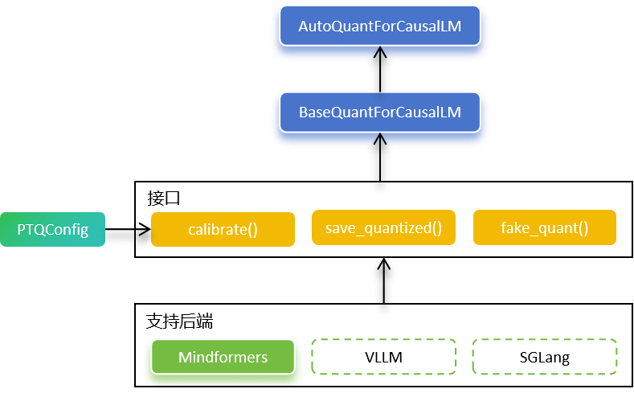
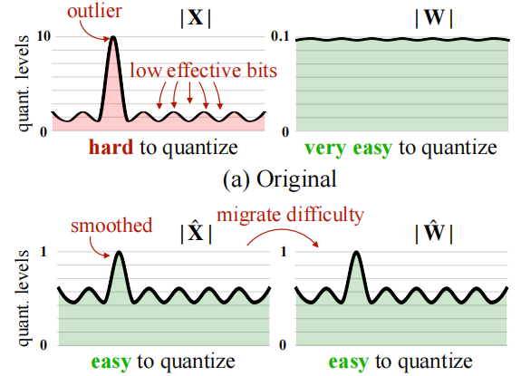
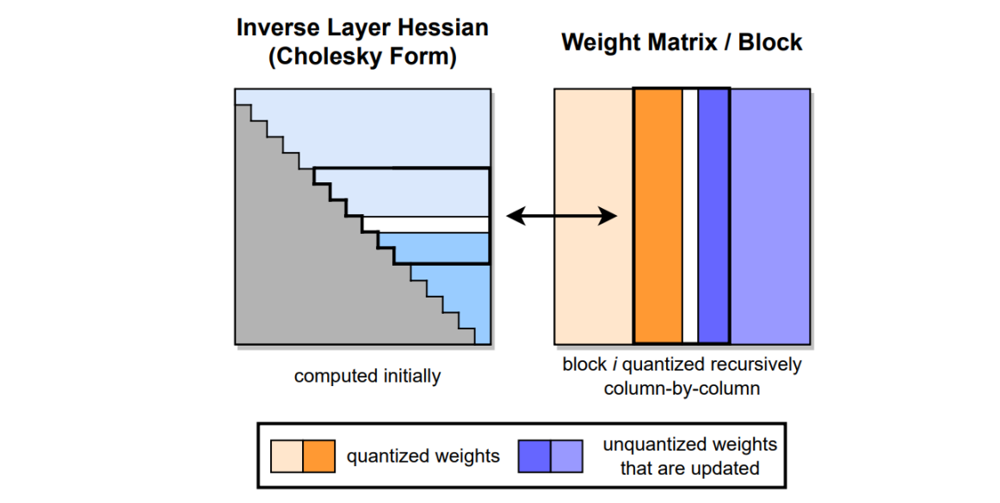

# 应用PTQ算法

[](https://gitee.com/mindspore/golden-stick/blob/master/mindspore_gs/ptq/ptq/README_CN.md)

[View English](./README.md)

## PTQ算法介绍

### 整体流程

金箍棒PTQ算法提供了昇腾硬件上的大语言模型（后称LLM）SOTA训练后量化算法能力。此外，MindSpore团队与华为泰勒团队基于MindSpore进行了算法创新，实现了昇腾硬件上更友好的自动搜优混合精度量化，这些能力也已集成到金箍棒中。



金箍棒提供AutoQuantForCausalLM和BaseQuantForCausalLM接口，供用户方便地在昇腾硬件上对LLM进行训练后量化。

AutoQuantForCausalLM可以根据预训练模型自动选择相应的量化模型实现，返回一个BaseQuantForCausalLM对象，进而对网络进行校准或评测。

BaseQuantForCausalLM是一个接口类，方便算法支持不同来源的网络，比如MindSpore Transformers、vLLM或SGLang等。目前仅支持MindSpore Transformers，vLLM原生网络的支持正在开发中。

为了提升量化算法对不同网络的效果，BaseQuantForCausalLM支持通过PTQConfig来按层进行量化策略的配置。当前已支持OutlierSuppressionLite（后称OSL）、SmoothQuant、A8W4、AWQ、GPTQ、KVCacheInt8、RTN量化算法，以及将这些量化策略应用于网络的不同层。

同时，BaseQuantForCausalLM提供了量化模型保存接口save_quantized()，可以将量化后的权重直接保存成Hugging Face格式。

### 使用限制

表1：PTQ算法规格

| 规格 | 规格说明 |
| --- | --- |
| 硬件支持 | Atlas 800I A2 |
| 运行模式支持 | 量化checkpoint阶段仅支持PyNative模式，量化推理阶段不限定模式，建议GraphMode获得更好的性能 |

### 算法支持

训练后量化算法有很多种分类维度，比如静态量化和动态量化；权重量化、激活量化和KVCache量化；MinMax量化、MSE量化、KL散度量化和直方图量化；还有各种量化的优化技术，从最简单的四舍五入量化，到SmoothQuant量化、GPTQ量化、AWQ量化等。

本小节从业界常见的量化算法范式来介绍PTQ算法的能力，在此之前先给出其他分类维度上的一些限制：

- 仅支持MinMax量化。
- 激活量化支持静态per-tensor量化和动态per-token量化。
- 权重量化支持per-channel和per-group量化。
- KVCache量化支持静态per-channel量化和动态per-token量化。
- 受限于硬件和算子支持，对于全量化，激活当前不支持per-channel的量化，权重不支持带zero point的量化。
- 硬件支持带zero point的权重量化，但当前PTQ算法没有开放这方面能力，仅支持不带zero point的权重量化。
- 由于MindSpore底层量化算子限制，当前金箍棒PTQ量化算法仅对MindSpore Transformers的一些Layer做了支持，其中[MindFormers的Linear层](https://gitee.com/mindspore/mindformers/blob/master/mindformers/parallel_core/inference/tensor_parallel/layers.py)和[MindFormers的moe层](https://gitee.com/mindspore/mindformers/blob/master/mindformers/parallel_core/inference/tensor_parallel/grouped_layers.py)支持激活和权重量化，[MindFormers的PageAttention层](https://gitee.com/mindspore/mindformers/blob/dev/mindformers/modules/paged_attention_mgr.py#L26)支持KVCache量化。如果用户需要量化其他框架的网络，需要用户提供相关量化算子实现，当前这方面自定义能力没有形成明确的接口，会在未来提供。

金箍棒当前已支持算法如下：

| 已支持算法 | 简要介绍 |
|-------|-------|
| [OutlierSuppressionLite算法](#outliersuppressionlite算法) | 由华为泰勒实验室与MindSpore团队联合开发，在SmoothQuant基础上为网络中的每个矩阵分别搜索最优超参α值 |
| [A8W4量化](#金箍棒支持组合量化) | 由MindSpore团队开发的层间混合量化算法，激活使用动态per-token的8-bit量化，权重使用per-group的4-bit GPTQ量化 |
| [SmoothQuant算法](#smoothquant算法) | A8W8量化，通过smooth_scale将激活的量化难度转移至权重 |
| [GPTQ算法](#gptq算法) | 对某个block内的所有参数逐个量化，弥补量化带来的精度损失 |
| [动态量化](#动态量化算法) | 激活或KVCache进行动态per-token量化 |
| [AWQ算法](#awq算法) | 通过离线网格搜索的方式实现权重低比特量化 |
| [RoundToNearest算法](#roundtonearest算法) |朴素的后量化算法，其取整方式使用了四舍五入的方式 |

#### SmoothQuant算法

研究发现，不同于CNN和小型的transformer网络，当大语言模型参数量超过6.8B时，网络的激活中出现"systematic outliers with large magnitude"，由于浮点的分布很广且不均匀，导致难以量化。



[SmoothQuant](https://arxiv.org/pdf/2211.10438)算法通过数学等价变换，将激活上的异常值转移一部分到权重上，从而将难以量化的激活和极易量化的权重转化为较易量化的激活和较易量化的权重，实现量化精度的提升。

**网络支持：** DeepSeekV3/R1、Qwen3、Qwen3-moe、Telechat2，具体请参见[MindSpore Transformers Mcore Network](https://gitee.com/mindspore/mindformers/blob/master/mindformers/parallel_core/inference/base_models/gpt/gpt_model.py#L38)。

可以通过如下配置项使能PTQ的SmoothQuant能力：

```python
from mindspore import dtype as msdtype
from mindspore_gs.ptq import PTQConfig, OutliersSuppressionType

ptq_config = PTQConfig(weight_quant_dtype=msdtype.int8, act_quant_dtype=msdtype.int8,
                       outliers_suppression=OutliersSuppressionType.SMOOTH)
```

#### OutlierSuppressionLite算法

OutlierSuppressionLite算法由华为泰勒实验室与MindSpore团队联合开发，是一种网格搜索算法，可进一步提升静态量化的精度，后续简称为OSL算法。

OSL是[OutlierSuppressionPlus](https://arxiv.org/abs/2304.09145)算法的简化版本，在[SmoothQuant](https://arxiv.org/pdf/2211.10438)算法的基础上，对SmoothQuant中的超参数α进行网格搜索，为网络中的每个矩阵分别搜索最优α值，更好地对异常值进行抑制，提升量化模型的精度。

> [SmoothQuant](https://arxiv.org/pdf/2211.10438)算法将激活值的量化难度转移到权重的量化上，同时引入超参数"迁移强度"(migration strength)α来控制这一幅度。论文通过整网粒度的实验得出，对于大多数模型而言α的最佳取值是0.5。然而，不同的模型结构、不同的decoder层位置、decoder层内矩阵的不同位置会导致激活值和权重的分布不同，进而导致α的最佳取值差异。

**网络支持：** DeepSeekV3/R1、Qwen3、Qwen3-moe、Telechat2，具体请参见[MindSpore Transformers Mcore Network](https://gitee.com/mindspore/mindformers/blob/master/mindformers/parallel_core/inference/base_models/gpt/gpt_model.py#L38)。

可以通过如下配置项使能PTQ的OSL能力：

```python
from mindspore import dtype as msdtype
from mindspore_gs.ptq import PTQConfig, OutliersSuppressionType

ptq_config = PTQConfig(weight_quant_dtype=msdtype.int8, act_quant_dtype=msdtype.int8,
                       outliers_suppression=OutliersSuppressionType.OUTLIER_SUPPRESSION_LITE)
```

#### GPTQ算法

[GPTQ](https://arxiv.org/abs/2210.17323)(Gradient-based Post-training Quantization)算法由OBD、OBS、OBC(OBQ)算法一步步演化而来，GPTQ算法是OBQ算法的加速版本。
GPTQ算法的核心思想是对某个block内的所有参数逐个量化，每个参数量化后，需要适当调整这个block内其他未量化的参数，以弥补量化造成的精度损失。



PTQ算法支持使用GPTQ算法进行8bit和4bit权重量化，并将其添加到了精度恢复算法集中，精度恢复算法当前仅GPTQ算法可选。

**网络支持：** [MindSpore Transformers Llama3.1/Llama2 网络](https://gitee.com/mindspore/mindformers/tree/master/research/llama3_1) 和 [MindSpore Transformers DeepSeekV3/R1 网络](https://gitee.com/mindspore/mindformers/tree/master/research/deepseek3)。

GPTQ算法支持per_group和per_channel量化，可以通过如下配置项使能GPTQ算法的per_channel量化:

```python
from mindspore import dtype as msdtype
from mindspore_gs.ptq import PTQConfig, OutliersSuppressionType, PrecisionRecovery, QuantGranularity
from mindspore_gs.ptq.ptq_config import GPTQQuantConfig

algorithm_config = GPTQQuantConfig(desc_act=False, static_groups=False, damp_percent=0.1, block_size=128)
ptq_config = PTQConfig(weight_quant_dtype=msdtype.qint4x2, act_quant_dtype=None, kvcache_quant_dtype=None,
                       outliers_suppression=OutliersSuppressionType.NONE, algo_args=algorithm_config,
                       weight_quant_granularity=QuantGranularity.PER_CHANNEL, group_size=0,
                       precision_recovery = PrecisionRecovery.GPTQ)
```

可以通过如下配置项使能GPTQ算法的per_group量化:

```python
from mindspore import dtype as msdtype
from mindspore_gs.ptq import PTQConfig, OutliersSuppressionType, PrecisionRecovery, QuantGranularity
from mindspore_gs.ptq.ptq_config import GPTQQuantConfig

algorithm_config = GPTQQuantConfig(desc_act=False, static_groups=False, damp_percent=0.1, block_size=128)
ptq_config = PTQConfig(weight_quant_dtype=msdtype.qint4x2, act_quant_dtype=None, kvcache_quant_dtype=None,
                       outliers_suppression=OutliersSuppressionType.NONE, algo_args=algorithm_config,
                       weight_quant_granularity=QuantGranularity.PER_GROUP, group_size=128,
                       precision_recovery = PrecisionRecovery.GPTQ)
```

#### 动态量化算法

当前金箍棒仅支持per-token的动态量化。per-token量化是指为每个token分配独立的量化参数来减少误差。动态量化是指量化参数在推理阶段实时计算，而不需要离线计算量化参数。

per-token动态量化算法是在推理过程中对激活/KVcache进行per-token在线量化，在线计算出token维度上的scale和zp，而无需使用数据集进行校准量化，与离线静态量化相比精度更高。当前per-token动态量化仅支持对称量化。

**网络支持：** [MindSpore Transformers Llama3.1/Llama2 网络](https://gitee.com/mindspore/mindformers/tree/master/research/llama3_1) 和 [MindSpore Transformers DeepSeekV3/R1 网络](https://gitee.com/mindspore/mindformers/tree/master/research/deepseek3)。

1. 激活 per-token动态量化

    激活per-token动态量化，首先需要对权重进行RoundToNearest量化，然后再使用量化的权重进行W8A8-per-token推理。同时，激活per-token动态量化也支持smooth操作，因此也可以在量化过程中计算smooth参数。

    - 包含smooth参数的激活per-token动态量化

      当需要包含smooth参数时，对应的配置项如下：

      ```python
      from mindspore import dtype as msdtype
      from mindspore_gs.ptq.ptq_config import PTQConfig, OutliersSuppressionType, QuantGranularity

      ptq_config = PTQConfig(weight_quant_dtype=msdtype.int8, act_quant_dtype=msdtype.int8,
                             act_quant_granularity=QuantGranularity.PER_TOKEN,
                             outliers_suppression=OutliersSuppressionType.SMOOTH)
      ```

      此时激活对应的计算公式如下：

      $$scale = \frac{row\_max(abs(X_{float} \cdot smooth\_scale))} {127}$$

      $$x_{int} = round(x_{float} \div scale)$$

    - 不包含smooth参数的激活per-token动态量化

      当不包含smooth参数时，对应的配置项如下：

      ```python
      from mindspore import dtype as msdtype
      from mindspore_gs.ptq.ptq_config import PTQConfig, OutliersSuppressionType, QuantGranularity

      ptq_config = PTQConfig(weight_quant_dtype=msdtype.int8, act_quant_dtype=msdtype.int8,
                             act_quant_granularity=QuantGranularity.PER_TOKEN,
                             outliers_suppression=OutliersSuppressionType.NONE)

      ```

      此时激活对应的计算公式如下：

      $$scale = \frac{row\_max(abs(X_{{float}}))} {127}$$

      $$x_{int} = round(x_{float} \div scale)$$

    同时也可以直接使用PTQ算法w8a16量化后的权重进行W8A8-per-token推理。

2. KVCache per-token动态量化

    对KVCache进行per-token动态量化，无需离线量化操作，可以直接传入原始的浮点权重进行推理。对应的配置项如下：

    ```python
    from mindspore import dtype as msdtype
    from mindspore_gs.ptq.ptq_config import PTQConfig, OutliersSuppressionType, QuantGranularity

    ptq_config = PTQConfig(weight_quant_dtype=None, act_quant_dtype=None,
                           kvcache_quant_dtype=msdtype.int8,
                           kvcache_quant_granularity=QuantGranularity.PER_TOKEN,
                           outliers_suppression=OutliersSuppressionType.NONE)
    ```

    此时KVCache对应的计算公式如下：

    $$scale = \frac{row\_max(abs(KVCache_{{float}}))} {127}$$

    $$KVCache_{int} = round(KVCache_{float} \div scale)$$

    > 因MindSpore Transformers的ParallelLlamaForCausalLM网络已经停止维护，在金箍棒1.2.0版本中，该网络不支持KVCache Int8量化，后续版本会在新的网络上支持KVCache Int8量化。

#### AWQ算法

[研究](https://arxiv.org/pdf/2306.00978)发现LLM中的每个权重并不是同等重要的，只有0.1%~1%的小部分权重对模型的输出精度影响很大，我们称这部分权重为显著权重。如果在量化过程中能够保护显著权重的精度，对其他权重进行低比特量化，就可以在精度几乎不变的情况下大幅降低模型的内存占用。


[Activation-Aware Weight Quantization，简称AWQ](https://arxiv.org/pdf/2306.00978)基于激活值分布挑选显著权重，并且考虑到硬件效率，通过缩放的方式来保护显著权重，避免同一个权重张量使用不同数据类型存储，从而实现了硬件友好的高精度权重量化算法，可以实现4bit甚至更低bit的量化。除了显著权重的保护，AWQ还引入了动态权重截断技术，进一步提升量化的精度。

**网络支持：** [MindSpore Transformers Llama3.1/Llama2 网络](https://gitee.com/mindspore/mindformers/tree/master/research/llama3_1) 和 [MindSpore Transformers DeepSeekV3/R1 网络](https://gitee.com/mindspore/mindformers/tree/master/research/deepseek3)。

金箍棒通过新增一种异常值抑制方法来支持AWQ，当前仅支持[ParallelLlamaForCausalLM网络](https://gitee.com/mindspore/mindformers/blob/master/research/llama3_1/llama.py)。

AWQ同时支持PerChannel量化和PerGroup量化，可以通过如下配置项使能PTQ的PerChannel AWQ算法：

```python
from mindspore import dtype as msdtype
from mindspore_gs.ptq import PTQConfig, OutliersSuppressionType

ptq_config = PTQConfig(weight_quant_dtype=msdtype.qint4x2, act_quant_dtype=None, kvcache_quant_dtype=None,
                       outliers_suppression=OutliersSuppressionType.AWQ)
```

或者：

```python
from mindspore import dtype as msdtype
from mindspore_gs.ptq import PTQConfig, OutliersSuppressionType, QuantGranularity

ptq_config = PTQConfig(weight_quant_dtype=msdtype.qint4x2, act_quant_dtype=None, kvcache_quant_dtype=None,
                       outliers_suppression=OutliersSuppressionType.AWQ,
                       weight_quant_granularity=QuantGranularity.PER_CHANNEL, group_size=0)
```

可以通过如下配置项使能PTQ的PerGroup AWQ算法：

```python
from mindspore import dtype as msdtype
from mindspore_gs.ptq import PTQConfig, OutliersSuppressionType, QuantGranularity

ptq_config = PTQConfig(weight_quant_dtype=msdtype.qint4x2, act_quant_dtype=None, kvcache_quant_dtype=None,
                       outliers_suppression=OutliersSuppressionType.AWQ,
                       weight_quant_granularity=QuantGranularity.PER_GROUP, group_size=128)
```

> 考虑到PerGroup量化在昇腾硬件上的推理性能，推荐将group_size设置为64或者128。

同时可以通过AWQConfig来指定AWQ的超参搜索范围：

```python
from mindspore import dtype as msdtype
from mindspore_gs.ptq import PTQConfig, OutliersSuppressionType, QuantGranularity, AWQConfig

awq_config = AWQConfig(duo_scaling=False, smooth_alpha=[0.5, 0.7, 0.9], weight_clip_ratio=[0.90, 0.95, 0.99])
ptq_config = PTQConfig(weight_quant_dtype=msdtype.qint4x2, act_quant_dtype=None, kvcache_quant_dtype=None,
                       outliers_suppression=OutliersSuppressionType.AWQ,
                       weight_quant_granularity=QuantGranularity.PER_GROUP, group_size=128, algo_args=awq_config)
```

#### RoundToNearest算法

RoundToNearest算法是一类较朴素的后量化算法，其取整方式使用了Round to nearest，即四舍五入的方式，故名RoundToNearest。该算法能力和金箍棒独立的[RoundToNearest](../round_to_nearest/README_CN.ipynb)算法能力类似，后续金箍棒会停止对RoundToNearest算法的演进，使用PTQ算法来支持RoundToNearest算法能力。

量化算法的主要逻辑是根据浮点数据如权重的最大最小值和整型数据的最大最小值，根据计算公式计算量化参数：

$$scale = \frac{X_{{float}_{max}} - {X_{float}}_{min}} {X_{{int}_{max}} - {X_{int}}_{min}}$$

$$offset = round(X_{{int}_{max}} - \frac{X_{{float}_{max}}} {scale})$$

其中scale是缩放因子，offset是平移因子，两者统称为量化参数。获得量化参数后就可以对权重做量化：

$$x_{int} = clamp(round(x_{float} \div scale) + offset; 0, 2^b-1)$$

RoundToNearest算法将上述量化过程应用于网络中的权重矩阵，将其转换为8bit整型进行存储。在部署时加载8bit权重后，对其进行反量化，其过程的数学表达如下：

$$X_{float} = (X_{int} - offset) \times scale$$

将权重反量化为浮点后，网络的推理过程就和一般的浮点网络推理过程无异。权重量化并不能带来计算量的减少，相反反量化会带来额外的计算量，所以通常将反量化的操作和后续的浮点计算过程进行融合，可以有效降低部署阶段的显存开销，同时可以缓解大语言模型增量推理阶段的Memory Bound，这两者都可以提升大语言模型部署时的吞吐量。


**网络支持：** [MindSpore Transformers Llama3.1/Llama2 网络](https://gitee.com/mindspore/mindformers/tree/master/research/llama3_1) 和 [MindSpore Transformers DeepSeekV3/R1 网络](https://gitee.com/mindspore/mindformers/tree/master/research/deepseek3)。

PTQ RoundToNearest算法当前支持8bit的权重量化能力，可以通过如下配置项使能：

```python
from mindspore import dtype as msdtype
from mindspore_gs.ptq import PTQConfig, OutliersSuppressionType

ptq_config = PTQConfig(weight_quant_dtype=msdtype.int8,  act_quant_dtype=None,  kvcache_quant_dtype=None,
                       outliers_suppression=OutliersSuppressionType.NONE)
```

#### 金箍棒支持组合量化

1. AxWx量化组合KVCache量化

    得益于分层解耦框架设计，金箍棒的PTQ算法可以方便地将不同的算法能力组合在一起，例如：

    - 8bit权重量化组合8bit KVCache量化：

      ```python
      from mindspore import dtype as msdtype
      from mindspore_gs.ptq import PTQConfig, OutliersSuppressionType

      ptq_config = PTQConfig(weight_quant_dtype=msdtype.int8, act_quant_dtype=None, kvcache_quant_dtype=msdtype.int8,
                             outliers_suppression=OutliersSuppressionType.NONE)
      ```

    - SmoothQuant量化组合8bit KVCache量化：

      ```python
      from mindspore import dtype as msdtype
      from mindspore_gs.ptq import PTQConfig, OutliersSuppressionType

      ptq_config = PTQConfig(weight_quant_dtype=msdtype.int8, act_quant_dtype=msdtype.int8, kvcache_quant_dtype=msdtype.int8,
                             outliers_suppression=OutliersSuppressionType.SMOOTH)
      ```

2. 层间组合量化-A8W4量化

    金箍棒也支持针对不同的层配置不同的量化策略，例如A8W4量化是一种组合量化算法。

    **网络支持：** DeepSeekV3/R1、Qwen3、Qwen3-moe、Telechat2，具体请参见[MindSpore Transformers Mcore Network](https://gitee.com/mindspore/mindformers/blob/master/mindformers/parallel_core/inference/base_models/gpt/gpt_model.py#L38)。

    以DeepSeekV3/R1网络为例，针对网络中的Attention模块采用OSL量化，稠密feed_forward模块采用动态A8W8量化，moe模块则采用动态A8W4量化。

    由于算子限制，金箍棒当前仅支持针对moe结构的A8W4量化。moe结构可参考[moe block](https://gitee.com/mindspore/mindformers/blob/master/mindformers/parallel_core/inference/transformer/moe/moe_layer.py#L100)。其中激活进行8-bit动态per-token量化，权重使用GPTQ进行4-bit per-group量化。

    以DeepSeekR1模型为例，A8W4模型权重压缩率可达70%，实现单机可部署，数据集精度误差在1%以内。

    对应的PTQConfig配置如下：

    ```python
    from mindspore import dtype as msdtype
    from mindspore_gs.ptq import (PTQConfig, PTQMode, BackendTarget,
                                  QuantGranularity, PrecisionRecovery,
                                  GPTQQuantConfig)

    gptq_config = GPTQQuantConfig(static_groups=True, desc_act=True)
    ptq_config = PTQConfig(mode=PTQMode.QUANTIZE, backend=BackendTarget.ASCEND,
                           weight_quant_dtype=msdtype.qint4x2, act_quant_dtype=msdtype.int8,
                           weight_quant_granularity=QuantGranularity.PER_GROUP,
                           group_size=64, algo_args=gptq_config,
                           act_quant_granularity=QuantGranularity.PER_TOKEN,
                           precision_recovery=PrecisionRecovery.GPTQ)
    ```

    备注：

    1) layer_policies中参数配置的优先级高于net_policy，当某层匹配到layer_policies配置，优先使用该策略。否则，使用net_policy策略。

    2) PTQConfig中的mode和backend参数，以net_policy为准。

    3) 当前配置策略仅支持人工按经验手动配置，后续规划为可自动配置。

## 示例

PTQ量化通常分为两个阶段：一个是量化校准阶段，另一个是部署阶段。

量化校准阶段包括：收集权重的分布、计算量化参数、量化权重数据、量化模型保存。

部署阶段包括：在生产环境下，使用MindSpore框架对量化后的模型进行推理的过程。

### Qwen3-0.6B 混合精度量化

本用例使用Mindformers框架下的Qwen3网络进行演示，主要分四个步骤：环境准备、模型量化、模型部署评估、效果分析。

#### 步骤1. 环境准备

1.1. Ascend环境

PTQ算法需要运行在Ascend硬件上，Ascend的环境配置可以参考[MindSpore安装指南](https://www.mindspore.cn/install)中的“安装昇腾AI处理器配套软件包”小节和“配置环境变量”小节。

1.2. MindSpore环境

金箍棒依赖于MindSpore，需要提前安装合适的MindSpore。可以从[MindSpore官网](https://www.mindspore.cn/versions)下载预编译好的安装包并安装。

1.3. MindFormers环境

本样例对MindFormers中的网络进行量化并推理，所以需要提前安装合适的MindFormers。可以从[MindSpore官网](https://www.mindspore.cn/versions)下载预编译好的安装包并安装。

1.4. 相关文件准备

**第一步** 创建工作目录：

```shell
mkdir workspace
```

**第二步** 下载开源CEval数据集，拷贝至workspace目录下：

Ceval下载地址：[CEval Dataset](https://huggingface.co/ceval)

**第三步** 下载Qwen3-0.6B权重，由于权限限制，需要手动下载：

模型下载地址：[Qwen3-0.6B](https://huggingface.co/Qwen/Qwen3-0.6B)

下载完成后，将得到的模型权重拷贝至第一步创建的workspace目录下。

**第四步** 下载Qwen3的yaml文件：

yaml下载地址：[predict_qwen3.yaml](https://gitee.com/mindspore/mindformers/blob/master/configs/qwen3/predict_qwen3.yaml)
下载完成后，将得到的yaml拷贝至第一步创建的workspace目录下。

**第五步** 进入workspace空间，下载金箍棒源码，并使用源码安装：

```python
git clone https://gitee.com/mindspore/golden-stick.git

cd golden-stick
pip install -e .
```

准备完上述文件后，目录结构为：

```shell
workspace
  └── ceval
  └── predict_qwen3.yaml
  └── Qwen3-0.6B
  └── golden-stick
```

#### 步骤2. 模型量化

2.1. 修改yaml文件

1. 修改predict_qwen3.yaml文件中的`load_checkpoint`和`pretrained_model_dir`字段为Qwen3-0.6B权重所在路径。

2. 若使用多卡进行量化校准，修改`use_parallel`为True，`model_parallel`为对应卡数。

3. 修改`mode`为1，使用动态图进行量化校准。

修改完成后，可以使用金箍棒提供的AutoQuantForCausalLM，方便地通过配置文件构造网络并加载checkpoint，代码如下：

```python
from mindspore_gs.ptq.models import AutoQuantForCausalLM

config_path = '/path/to/workspace/predict_qwen3.yaml'
model = AutoQuantForCausalLM.from_pretrained(config_path)
```

2.2. 构造校准数据集

我们可以使用Ceval数据来进行量化校准，一般量化校准阶段只会使用数百条数据进行校准。当前样例中，我们使用n_samples参数指定仅加载数据集中的200条数据，代码如下：

```python
from mindformers import MindFormerConfig
from mindspore_gs.datasets import get_datasets
from transformers import AutoTokenizer

config_path = '/path/to/workspace/predict_qwen3.yaml'
mfconfig = MindFormerConfig(config_path)
tokenizer = AutoTokenizer.from_pretrained(mfconfig.pretrained_model_dir, trust_remote_code=True)

seq = 2048
max_decode_length = 1024
ignore_token_id = tokenizer.pad_token_id
ds_path = "/path/to/ceval/dev"
datasets = get_datasets("ceval", ds_path, 'train', 1, seq, max_decode_length, tokenizer, ignore_token_id, 1, False, n_samples=200)
```

2.3. 构造量化校准策略及模型量化校准

我们可以根据PTQConfig配置来启用不同的量化能力，PTQConfig的含义可以参考其[API文档](https://www.mindspore.cn/golden_stick/docs/zh-CN/master/ptq/mindspore_gs.ptq.PTQConfig.html#mindspore_gs.ptq.PTQConfig)，这里我们以混合精度量化为例：

1. 0~9层的attention模块使用OSL进行校准。

2. 10~19层的attention模块使用SmoothQuant进行校准。

3. 整网的feed_forward模块使用动态A8W8进行校准。

```python
from collections import OrderedDict
from mindspore import dtype as msdtype
from mindspore_gs.common import BackendTarget
from mindspore_gs.ptq import (PTQConfig, PTQMode,
                              OutliersSuppressionType,
                              QuantGranularity)

a8w8_dynamic_cfg = PTQConfig(mode=PTQMode.QUANTIZE, backend=BackendTarget.ASCEND,
                             weight_quant_dtype=msdtype.int8, act_quant_dtype=msdtype.int8,
                             act_quant_granularity=QuantGranularity.PER_TOKEN,
                             opname_blacklist=['output_layer'])
smoothquant_cfg = PTQConfig(mode=PTQMode.QUANTIZE, backend=BackendTarget.ASCEND,
                            weight_quant_dtype=msdtype.int8, act_quant_dtype=msdtype.int8,
                            act_quant_granularity=QuantGranularity.PER_TENSOR,
                            outliers_suppression=OutliersSuppressionType.SMOOTH,
                            opname_blacklist=['output_layer', 'linear_fc2'])
osl_cfg = PTQConfig(mode=PTQMode.QUANTIZE, backend=BackendTarget.ASCEND,
                    weight_quant_dtype=msdtype.int8, act_quant_dtype=msdtype.int8,
                    act_quant_granularity=QuantGranularity.PER_TENSOR,
                    outliers_suppression=OutliersSuppressionType.OUTLIER_SUPPRESSION_LITE,
                    opname_blacklist=['output_layer', 'linear_fc2'])
cfg = a8w8_dynamic_cfg
layer_policies = OrderedDict({r'.*\.[0-9]\.self_attention.*': osl_cfg,
                              r'.*\.1[0-9]\.self_attention.*': smoothquant_cfg,
                              })
```

有了PTQConfig以后，接下来可通过模型的calibrate接口进行模型的量化校准，代码如下：

> 对于Qwen3网络，某些层对于量化比较敏感，不适合量化，我们通常通过opname_blacklist字段来帮助跳过这些层的量化。

```python
model.calibrate(cfg, layer_policies, datasets)
```

2.4. 量化网络的保存

接下来可通过模型的save_quantized()接口对量化校准后的网络进行保存。

```python
output_dir = "./output/Qwen3-mix-quant"
model.save_quantized(output_dir)
```

成功运行后，量化后的权重文件和量化策略描述文件会保存在 `./output/Qwen3-mix-quant` 路径下。

output/Qwen3-mix-quant的目录结构应为：

```shell
Qwen3-mix-quant
  └── config.json
  └── generation_config.json
  └── model.safetensors.index.json
  └── quant-model-00001-of-00001.safetensors
  └── quantization_description.json
  └── tokenizer_config.json
  └── vocab.json
```
