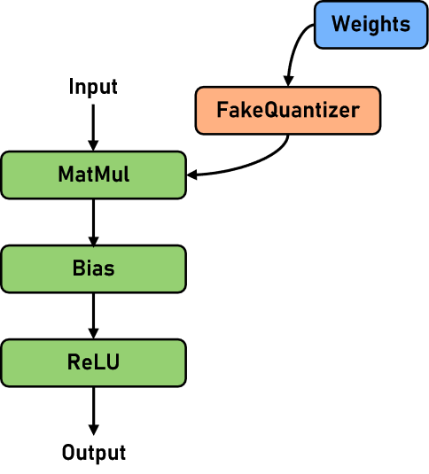

# Applying RoundToNearest Post-Quantization Algorithm

[查看中文](./README_CN.ipynb)

## Introduction to RoundToNearest Post-Quantization Algorithm

The RoundToNearest algorithm is a plainer class of post-quantization algorithms that use Round to nearest, i.e. rounding off, for their rounding.

The current RoundToNearest post-quantization (RTN is used later for short) in Golden Stick focuses on the LLM (Large Language Model scenario) and uses the MinMax corrector to quantize the linear layer (Linear). The network structure for pseudo-quantization is schematically shown below:



Table 1: RTN algorithm specifications

| Specifications | Specification Descriptions |
| --- | --- |
| Hardware support | The quantization phase runs on the CPU, and quantization model inference is only supported in Ascend |
| Network support | Llama2 13B/70B. For details, refer to [Llama2 network](https://gitee.com/mindspore/mindformers/tree/dev/mindformers/models/llama) |
| Running mode support | Graph mode and PyNative mode |

Table 2: Before and after quantization of the network using RTN algorithm

<table>
<tr>
    <th rowspan='2'>Metrics</th>
    <th colspan='3'>llama2-7B</th>
    <th colspan='3'>llama2-13B</th>
    <th colspan='3'>llama2-70B</th>
    <th colspan='3'>baichuan2-13B</th>
    <th colspan='3'>chatGLM3-6B</th>
</tr>
<tr>
    <th>FP16</th><th>W8A16</th><th>Profit</th>
    <th>FP16</th><th>W8A16</th><th>Profit</th>
    <th>FP16</th><th>W8A16</th><th>Profit</th>
    <th>FP16</th><th>W8A16</th><th>Profit</th>
    <th>FP16</th><th>W8A16</th><th>Profit</th>
</tr>
<tr>
    <td>ckpt-size(GB)↓</td>
    <td>13</td><td>7.1</td><td>-45.38%</td>
    <td>25</td><td>14</td><td>-44.00%</td>
    <td>129</td><td>65</td><td>-49.61%</td>
    <td>26</td><td>15</td><td>-42.31%</td>
    <td>12</td><td>6.1</td><td>-49.17%</td>
</tr>
<tr>
    <td>wikitext2-Perplexity↓</td>
    <td>15.130</td><td>15.129</td><td>0.00</td>
    <td>14.18</td><td>14.203</td><td bgcolor='#FA8072'>0.02</td>
    <td>10.379</td><td>10.435</td><td bgcolor='#FA8072'>0.046</td>
    <td>23.955</td><td>23.912</td><td>-0.043</td>
    <td>-</td><td>-</td><td>-</td>
</tr>
<tr>
    <td>squad1.1-F1↑</td>
    <td>60.48</td><td>60.76</td><td>0.28</td>
    <td>-</td><td>-</td><td>-</td>
    <td>-</td><td>-</td><td>-</td>
    <td>-</td><td>-</td><td>-</td>
    <td>-</td><td>-</td><td>-</td>
</tr>
<tr>
    <td>squad1.1-EM↑</td>
    <td>39.62</td><td>39.57</td><td bgcolor='#FA8072'>-0.05</td>
    <td>-</td><td>-</td><td>-</td>
    <td>-</td><td>-</td><td>-</td>
    <td>-</td><td>-</td><td>-</td>
    <td>-</td><td>-</td><td>-</td>
</tr>
<tr>
    <td>Full-scale Performance (tokens/s)</td>
    <td>9.08</td><td>9.04</td><td>0</td>
    <td>-</td><td>-</td><td>-</td>
    <td>-</td><td>-</td><td>-</td>
    <td>-</td><td>-</td><td>-</td>
    <td>-</td><td>-</td><td>-</td>
</tr>
<tr>
    <td>Incremental Performance (tokens/s)</td>
    <td>30.24</td><td>21.08</td><td bgcolor='#FA8072'>-30.29%</td>
    <td>-</td><td>-</td><td>-</td>
    <td>-</td><td>-</td><td>-</td>
    <td>-</td><td>-</td><td>-</td>
    <td>-</td><td>-</td><td>-</td>
</tr>
<tr>
    <td>Video Memory(GB)</td>
    <td>-</td><td>-</td><td>-</td>
    <td>27</td><td>16</td><td>-40.7%</td>
    <td>-</td><td>-</td><td>-</td>
    <td>-</td><td>-</td><td>-</td>
    <td>-</td><td>-</td><td>-</td>
</tr>
</table>

## Examples

As with all algorithms in the Golden Stick, the application of RTN algorithms can be divided into two main phases: the quantization phase and the deployment phase.

The quantization phase is done in advance before deployment and the main tasks are: collecting the distribution of weights, calculating the quantization parameters, quantizing the weight data, and inserting the anti-quantization nodes.

The deployment phase usually refers to the process where the user uses the MindSpore framework to perform inference about the quantized model in a production environment.

This use case is demonstrated using the Llama2 network in four main steps: environment preparation, model quantification, model deployment evaluation, and effect analysis.

### Step 1 Environment Preparation

#### 1.1. Ascend Environment

The RTN algorithm needs to run on Ascend hardware, and the environment configuration of Ascend can be found in the Installation of Ascend AI Processor Package subsection and Configuring Environment Variables subsection in [MindSpore Installation Guide](https://www.mindspore.cn/install).

#### 1.2. MindSpore Environment

Golden Stick relies on MindSpore, and you need to install the proper MindSpore in advance. You can download the pre-compiled [v2.3.1 version installer](https://www.mindspore.cn/versions) from the MindSpore official website and install it.

#### 1.3. MindFormers Environment

Golden Stick relies on MindFormers, and you need to install the proper MindFormers in advance. You can download the pre-compiled MindFormers [v1.2.0 installer](https://www.mindspore.cn/versions) from the MindSpore website and install it.

#### 1.4. Golden Stick Environment

Download the pre-compiled [MindSpore GoldenStick v0.5.0 version installer](https://www.mindspore.cn/versions) from the MindSpore website and install it.

#### 1.5. Preparation of Relevant Documents

Pre-download MindSpore Transformers Llama2 network-related files and the datasets used for the evaluation, including: the wikitext2 dataset and the Llama2 7B network-related files.

Step 1: creates a working directory:

```text
!mkdir workspace
```

Step 2: Prepare the dataset. You need to download the wikitext2 dataset manually due to permissions restrictions:

Dataset download address: [WikiText2 dataset](https://s3.amazonaws.com/research.metamind.io/wikitext/wikitext-2-v1.zip)

After downloading the dataset, you need to copy the dataset file to the workspace directory created in the previous step and make sure that the dataset file name is wikitext-2-v1.zip, and then run the decompression code:

```text
!cd workspace; unzip wikitext-2-v1.zip
```

The running results are as follows:

```text
Archive:  wikitext-2-v1.zip
   creating: wikitext-2/
  inflating: wikitext-2/wiki.test.tokens  
  inflating: wikitext-2/wiki.valid.tokens  
  inflating: wikitext-2/wiki.train.tokens
```

Step 3: Prepare the Llama2 7B network checkpoint file, the Llama2 disambiguator file, and the Llama2 model configuration file:

```text
!cd workspace; wget --no-check-certificate -O llama2_7b.ckpt https://ascend-repo-modelzoo.obs.cn-east-2.myhuaweicloud.com/MindFormers/llama2/llama2_7b.ckpt
!cd workspace; wget --no-check-certificate -O tokenizer.model https://ascend-repo-modelzoo.obs.cn-east-2.myhuaweicloud.com/MindFormers/llama2/tokenizer.model
!cd workspace; cp ../configs/predict_llama2_7b_910b.yaml ./
```

The running results are as follows:

```text
--2024-03-19 17:29:17--  https://ascend-repo-modelzoo.obs.cn-east-2.myhuaweicloud.com/MindFormers/llama2/llama2_7b.ckpt
Length: 13476850247 (13G) [binary/octet-stream]
Saving to: ‘llama2_7b.ckpt’

llama2_7b.ckpt      100%[===================>]  12.55G  27.5MB/s    in 7m 39s  

2024-03-19 17:36:57 (28.0 MB/s) - ‘llama2_7b.ckpt’ saved [13476850247/13476850247]

--2024-03-19 17:36:57--  https://ascend-repo-modelzoo.obs.cn-east-2.myhuaweicloud.com/MindFormers/llama2/tokenizer.model
Length: 499723 (488K) [binary/octet-stream]
Saving to: ‘tokenizer.model’

tokenizer.model     100%[===================>] 488.01K  --.-KB/s    in 0.1s

2024-03-19 17:36:57 (3.37 MB/s) - ‘tokenizer.model’ saved [499723/499723]
```

> If you encounter network problems when downloading, you can try to use the browser to download the corresponding file manually and put it into the appropriate directory.

Step 4: Modify the predict_llama2_7b_910b.yaml file by overriding the paths of checkpoint, tokenizer to the load_checkpoint field in the yaml configuration file and to the vocab_file field in the processor chapter respectively. Also modify the device_id in the context chapter to the current idle device id of the machine.

After completing the above preparation, check the catalog structure:

```text
!cd workspace; tree -L 2 -U
```

The running results are as follows:

```text
.
├── llama2_7b.ckpt
├── wikitext-2
│   ├── wiki.train.tokens
│   ├── wiki.test.tokens
│   └── wiki.valid.tokens
├── tokenizer.model
├── wikitext-2-v1.zip
└── predict_llama2_7b_910b.yaml

1 directory, 7 files
```

### Step 2. Model Quantization

Construct the Llama2 network for the MindSpore Transformers, then quantize the network using the Golden Stick RoundToNearest algorithm, and finally save the quantized checkpoint file:

```python
import os
import time

import mindspore as ms
from mindformers import LlamaForCausalLM, MindFormerConfig, LlamaConfig, init_context
from mindspore_gs.ptq import PTQMode, PTQConfig
from mindspore_gs.common import BackendTarget, logger
from mindspore_gs.ptq import RoundToNearest as RTN
from mindspore_gs.ptq.network_helpers.mf_net_helpers import MFLlama2Helper


class Llama2Network:
    """Llama2Network."""
    @staticmethod
    def create_mfconfig(config_path):
        """Create mindformers config for llama2 network for example."""
        config = MindFormerConfig(config_path)
        config.model.model_config = LlamaConfig(**config.model.model_config)
        init_context(use_parallel=config.use_parallel, context_config=config.context, parallel_config=config.parallel)
        return config

    @staticmethod
    def create_network(mindformers_config):
        network = LlamaForCausalLM(mindformers_config.model.model_config)
        network.set_train(False)
        network.phase = 'predict'
        return network


def quant_network(net: LlamaForCausalLM, mode=PTQMode.QUANTIZE, backend=BackendTarget.ASCEND, **kwargs):
    """Quant llama2 model to w8a16 with RTN algorithm."""
    start_time = time.time()
    if mode == PTQMode.QUANTIZE:
        logger.info("Use RTN algo to quant network and weight.")
    else:
        logger.info("Use RTN algo to quant network.")
    cfg = PTQConfig(mode=mode, backend=backend, opname_blacklist=["lm_head"])
    ptq = RTN(config=cfg)
    logger.info(f'Create PTQ cost time is {time.time() - start_time} s.')
    start_time = time.time()
    mfconfig = kwargs.get("mfconfig", None)
    if not mfconfig:
        raise ValueError("Please provide mfconfig for calibrating.")
    network_helper = MFLlama2Helper(mfconfig)
    net = ptq.apply(net, network_helper)
    logger.info(f'Apply PTQ cost time is {time.time() - start_time} s.')
    start_time = time.time()
    net.phase = "quant_convert"
    net = ptq.convert(net)
    logger.info(f'Convert to real quantize cost time is {time.time() - start_time} s.')
    return net


start = time.time()
print('------------------------- Creating network...', flush=True)
net_mgr: Llama2Network = Llama2Network()
config = net_mgr.create_mfconfig("./workspace/predict_llama2_7b_910b.yaml")
network = net_mgr.create_network(config)
logger.info(f'Create Network cost time is {time.time() - start} s.')
start = time.time()
ckpt_path = config.load_checkpoint
logger.info(f'Loading ckpt :{ckpt_path}.')
ms.load_checkpoint(ckpt_path, network)
ms.ms_memory_recycle()
logger.info(f'Load ckpt cost time is {time.time() - start} s.')
print('------------------------- Quantize-ing network...', flush=True)
start = time.time()
network = quant_network(network, mode=PTQMode.QUANTIZE, backend=BackendTarget.ASCEND, mfconfig=config)
logger.info(f'Quant Network cost time is {time.time() - start} s.')
print('------------------------- Saving checkpoint...', flush=True)
start = time.time()
save_ckpt_path = os.path.join(config.output_dir, "w8a16_ckpt")
save_path = os.path.join(save_ckpt_path, f"rank_0")
os.makedirs(save_path, exist_ok=True)
ms.save_checkpoint(network.parameters_dict(), os.path.join(save_path, "w8a16.ckpt"),
                   choice_func=lambda x: "key_cache" not in x and "value_cache" not in x)
logger.info(f'Save checkpoint cost time is {time.time() - start} s.')
print(f'------------------------- Checkpoint saved to {save_path}...', flush=True)
```

The running results are as follows:

```text
------------------------- Quantize-ing network...
2024-03-19 19:19:37,711 - mindformers[mindformers/models/llama/llama.py:359] - INFO - Predict run mode:True
------------------------- Quantize-ing network...
2024-03-19 19:37:11,103 - mindformers[mindformers/generation/text_generator.py:914] - INFO - total time: 53.80364537239075 s; generated tokens: 1 tokens; generate speed: 0.018586101240514612 tokens/save_checkpoint
------------------------- Saving checkpoint...
------------------------- Checkpoint saved to ./output/w8a16_ckpt/rank_0/...
```

After successfully running, the quantized checkpoint file is saved under the `. /output/w8a16_ckpt/rank_0/w8a16.ckpt` path.

### Step 3. Model Deployment

#### 3.1. Evaluating Perplexity Metrics for FP16 Networks

Evaluating the confusion metrics for the Llama2-7B network using the WikiText2 dataset. Before evaluation, it should be noted that the RUN_MODE environment variable is not configured in the environment.

```python
import mindspore as ms
from mindformers.core.metric import PerplexityMetric
from mindspore_gs.datasets import create_wikitext_dataset
from mindspore_gs.ptq.network_helpers.mf_net_helpers import MFLlama2Helper


net_mgr: Llama2Network = Llama2Network()
fp16_network_config = net_mgr.create_mfconfig("./workspace/predict_llama2_7b_910b.yaml")
fp16_network_config.model.model_config.use_past = False
pad_token_id = fp16_network_config.model.model_config.pad_token_id
fp16_network = net_mgr.create_network(fp16_network_config)
ms.load_checkpoint(fp16_network_config.load_checkpoint, fp16_network)


net_helper = MFLlama2Helper(fp16_network_config)
bs = net_helper.get_spec("batch_size")
seq_len = net_helper.get_spec("seq_length")
tokenizer = net_helper.create_tokenizer()

fp16_ds = create_wikitext_dataset("./workspace/wikitext-2/wiki.valid.tokens", bs, seq_len, max_new_tokens=1, tokenizer=tokenizer)
metric = PerplexityMetric()
metric.clear()
data_count = 0
total_count = fp16_ds.get_dataset_size()
for _, ds_item in enumerate(fp16_ds.create_dict_iterator()):
    data_count += 1
    logger.info(f"Dataset count: {data_count}/{total_count}")
    input_ids = ds_item['input_ids'].asnumpy()
    net_inputs = net_helper.assemble_inputs(input_ids)
    outputs = fp16_network(*net_inputs)
    metric.update(*outputs)
print('...........Evaluate Over!...............', flush=True)
print(f"FP16 PPL: {metric.eval()}", flush=True)
```

The running results are as follows:

```text
......
2024-03-19 19:41:52,132 - mindformers[mindformers/models/modeling_utils.py:1413] - INFO - weights in ./workspace/llama2_7b.ckpt are loaded
[INFO] GE(2617230,python):2024-03-19-19:42:00.316.847 [ge_api.cc:523][status:INIT]2617230 AddGraph:Start to add graph in Session. graph_id: 1, graph_name: kernel_graph0, session_id: 0.
[INFO] GE(2617230,python):2024-03-19-19:42:00.317.200 [ge_api.cc:1154][status:INIT]2617230 CompileGraph:Start to compile graph, graph_id: 1
[INFO] GE(2617230,python):2024-03-19-19:42:00.317.282 [graph_manager.cc:1264][EVENT]2617230 PreRun:PreRun start: graph node size 1, session id 0, graph id 1, graph name kernel_graph0.
......
[INFO] GE(2617230,python):2024-03-19-19:43:17.424.380 [ge_api.cc:787][status:INIT]2654383 RunGraphWithStreamAsync:Session run graph with stream async, session_id: 0, graph_id: 2, input size 291, output size 3
[INFO] GE(2617230,python):2024-03-19-19:43:17.424.812 [ge_api.cc:799][status:STOP]2654383 RunGraphWithStreamAsync:Session run graph with stream async finished.
[INFO] GE(2617230,python):2024-03-19-19:43:17.464.158 [ge_api.cc:787][status:INIT]2654383 RunGraphWithStreamAsync:Session run graph with stream async, session_id: 0, graph_id: 3, input size 3, output size 1
[INFO] GE(2617230,python):2024-03-19-19:43:17.464.296 [ge_api.cc:799][status:STOP]2654383 RunGraphWithStreamAsync:Session run graph with stream async finished.
FP16 PPL: {'PerplexityMetric': {'loss': 2.247190694278072, 'PPL': 9.460511724873594}}
```

#### 3.2. Instantiating Non-quantized Llama2 Networks

```python
import mindspore as ms
from mindformers.core.metric import PerplexityMetric
from mindspore_gs.datasets import create_wikitext_dataset
from mindspore_gs.ptq.network_helpers.mf_net_helpers import MFLlama2Helper


net_mgr: Llama2Network = Llama2Network()
network_config = net_mgr.create_mfconfig("./workspace/predict_llama2_7b_910b.yaml")
network_config.model.model_config.use_past = False
pad_token_id = network_config.model.model_config.pad_token_id
w8a16_network = net_mgr.create_network(network_config)
```

The running results are as follows:

```text
2024-03-19 19:19:37,710 - mindformers[mindformers/version_control.py:62] - INFO - The Cell Reuse compilation acceleration feature is not supported when the environment variable ENABLE_CELL_REUSE is 0 or MindSpore version is earlier than 2.1.0 or stand_alone mode or pipeline_stages <= 1
2024-03-19 19:19:37,710 - mindformers[mindformers/version_control.py:66] - INFO -
The current ENABLE_CELL_REUSE=0, please set the environment variable as follows:
export ENABLE_CELL_REUSE=1 to enable the Cell Reuse compilation acceleration feature.
2024-03-19 19:19:37,711 - mindformers[mindformers/version_control.py:72] - INFO - The Cell Reuse compilation acceleration feature does not support single-card mode.This feature is disabled by default. ENABLE_CELL_REUSE=1 does not take effect.
2024-03-19 19:19:37,712 - mindformers[mindformers/version_control.py:75] - INFO - The Cell Reuse compilation acceleration feature only works in pipeline parallel mode(pipeline_stage>1).Current pipeline stage=1, the feature is disabled by default.
2024-03-19 19:21:07,859 - mindformers[mindformers/models/modeling_utils.py:1415] - INFO - model built, but weights is unloaded, since the config has no checkpoint_name_or_path attribute or checkpoint_name_or_path is None.
```

#### 3.3. Loading Quantized ckpt

Since currently MindSpore does not support saving modified networks, an algorithm is used to recover the network with quantized structures before loading the quantized ckpt to the network.

```python
deploy_cfg = PTQConfig(mode=PTQMode.DEPLOY, backend=BackendTarget.ASCEND, opname_blacklist=["lm_head"])
deploy_ptq = RTN(config=deploy_cfg)
w8a16_network = deploy_ptq.apply(w8a16_network)
w8a16_network = deploy_ptq.convert(w8a16_network)
ms.load_checkpoint("./output/w8a16_ckpt/rank_0/w8a16.ckpt", w8a16_network)
```

The running results are as follows:

```text
{'model.tok_embeddings.embedding_weight': Parameter (name=model.tok_embeddings.embedding_weight, shape=(32000, 4096), dtype=Float16, requires_grad=True),
 ......
 'model.layers.31.feed_forward.w3._weight_quantizer.scale': Parameter (name=model.layers.31.feed_forward.w3._weight_quantizer.scale, shape=(11008,), dtype=Float16, requires_grad=True),
 'model.layers.31.feed_forward.w3._weight_quantizer.zp_neg': Parameter (name=model.layers.31.feed_forward.w3._weight_quantizer.zp_neg, shape=(11008,), dtype=Float16, requires_grad=True),
 'model.norm_out.weight': Parameter (name=model.norm_out.weight, shape=(4096,), dtype=Float32, requires_grad=True),
 'lm_head.weight': Parameter (name=lm_head.weight, shape=(32000, 4096), dtype=Float16, requires_grad=True)}
```

#### 3.4. Evaluating Quantified Networks

This example evaluates the Perplexity metric for Llama2 on the wikitext2 dataset. Instantiate the Splitter object and the dataset object using the downloaded splitter and dataset files from step 1, respectively, and instantiate the PerplexityMetric object as the metric.

```python
net_helper = MFLlama2Helper(network_config)
bs = net_helper.get_spec("batch_size")
seq_len = net_helper.get_spec("seq_length")
tokenizer = net_helper.create_tokenizer()

ds = create_wikitext_dataset("./workspace/wikitext-2/wiki.valid.tokens", bs, seq_len, max_new_tokens=1, tokenizer=tokenizer)
metric = PerplexityMetric()
metric.clear()
data_count = 0
total_count = ds.get_dataset_size()
for _, ds_item in enumerate(ds.create_dict_iterator()):
    data_count += 1
    logger.info(f"Dataset count: {data_count}/{total_count}")
    input_ids = ds_item['input_ids'].asnumpy()
    net_inputs = net_helper.assemble_inputs(input_ids)
    outputs = w8a16_network(*net_inputs)
    metric.update(*outputs)
print('...........Evaluate Over!...............', flush=True)
print(f"W8A16 PPL: {metric.eval()}", flush=True)
```

The running results are as follows:

```text
[INFO] GE(1746443,python):2024-03-19-19:25:18.990.947 [ge_api.cc:523][status:INIT]1746443 AddGraph:Start to add graph in Session. graph_id: 1, graph_name: kernel_graph224, session_id: 0.
[INFO] GE(1746443,python):2024-03-19-19:25:18.991.481 [ge_api.cc:1154][status:INIT]1746443 CompileGraph:Start to compile graph, graph_id: 1
[INFO] GE(1746443,python):2024-03-19-19:25:18.991.586 [graph_manager.cc:1264][EVENT]1746443 PreRun:PreRun start: graph node size 1, session id 0, graph id 1, graph name kernel_graph224.
[INFO] GE(1746443,python):2024-03-19-19:25:19.065.657 [ge_api.cc:1160][status:STOP]1746443 CompileGraph:Compile graph success.
[INFO] GE(1746443,python):2024-03-19-19:25:19.067.797 [ge_api.cc:787][status:INIT]2453595 RunGraphWithStreamAsync:Session run graph with stream async, session_id: 0, graph_id: 1, input size 0, output size 0
[INFO] GE(1746443,python):2024-03-19-19:25:19.079.152 [ge_api.cc:799][status:STOP]2453595 RunGraphWithStreamAsync:Session run graph with stream async finished.
[INFO] GE(1746443,python):2024-03-19-19:26:40.520.923 [ge_api.cc:523][status:INIT]1746443 AddGraph:Start to add graph in Session. graph_id: 2, graph_name: kernel_graph225, session_id: 0.
[INFO] GE(1746443,python):2024-03-19-19:26:40.581.045 [ge_api.cc:1154][status:INIT]1746443 CompileGraph:Start to compile graph, graph_id: 2
[INFO] GE(1746443,python):2024-03-19-19:26:40.633.523 [graph_manager.cc:1264][EVENT]1746443 PreRun:PreRun start: graph node size 3025, session id 0, graph id 2, graph name kernel_graph225.
[INFO] GE(1746443,python):2024-03-19-19:28:24.659.856 [ge_api.cc:799][status:STOP]2453595 RunGraphWithStreamAsync:Session run graph with stream async finished.
[INFO] GE(1746443,python):2024-03-19-19:28:24.665.855 [ge_api.cc:787][status:INIT]2453595 RunGraphWithStreamAsync:Session run graph with stream async, session_id: 0, graph_id: 2, input size 739, output size 3
[INFO] GE(1746443,python):2024-03-19-19:28:24.667.497 [ge_api.cc:799][status:STOP]2453595 RunGraphWithStreamAsync:Session run graph with stream async finished.
[INFO] GE(1746443,python):2024-03-19-19:28:25.267.844 [ge_api.cc:787][status:INIT]2453595 RunGraphWithStreamAsync:Session run graph with stream async, session_id: 0, graph_id: 3, input size 3, output size 1
......
[INFO] GE(1746443,python):2024-03-19-19:29:18.708.299 [ge_api.cc:799][status:STOP]2453595 RunGraphWithStreamAsync:Session run graph with stream async finished.
W8A16 PPL: {'PerplexityMetric': {'loss': 2.237087654840339, 'PPL': 9.365711954412435}}
```

### Step 4. Analyzing the Effects

Table 3: Before and after quantization of RTN algorithm for Llama2 7B network

| Metrics | FP16 | W8A16 | Profit |
| --- | --- | --- | --- |
| ckpt-size(GB)↓ | 13 | 7.1 | -5.9 |
| wikitext2-Perplexity↓ | 9.46 | 9.37 | -0.09 |

After being processed by the RTN quantization algorithm:

1. The number of parameters in the quantized network shrinks by 5.9 GB to only 54.6% of the original Float16. When the network is deployed, the amount of video memory used for static weight storage drops to 54.6% of the Float16. The quantized network can be deployed on more resource-constrained environments or provide greater throughput in the same environment.
2. The confusion of the quantized network on the wikitext2 dataset decreases upward by 0.09, i.e., the quantized network works better on wikitext2 for generative tasks.
