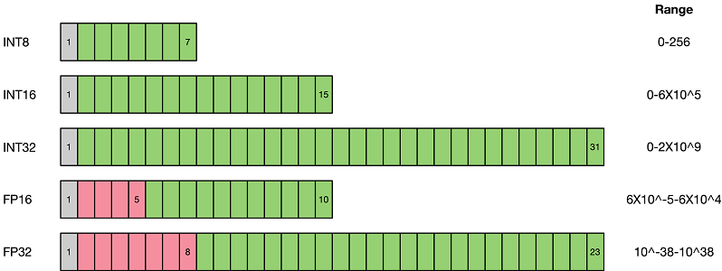

# 量化感知训练算法概述

[View English](./README.md)

本文档介绍量化感知训练算法的基本概念和原理，帮助用户理解量化技术的核心思想。如果已经对量化算法有深入了解，可以直接跳转到[示例](#示例)部分。

## 背景

随着深度学习技术的快速发展，神经网络在图像识别、自然语言处理、语音识别等领域得到了广泛应用。然而，网络准确率提升的同时，也带来了参数量和计算量的急剧增长。

以移动设备为例，为了提供智能化服务，操作系统和APP应用开始广泛集成AI功能。这不可避免地需要在设备中部署神经网络模型。以经典的AlexNet为例，其原始权重文件已超过200MB，而现代网络模型正朝着结构更复杂、参数更多的方向发展。

由于移动设备和边缘设备的硬件资源有限，需要对网络模型进行精简，量化（Quantization）技术就是解决这类问题的关键技术之一。网络量化是一种将浮点计算转换为低比特定点计算的技术，可以有效地降低网络的计算量、参数大小和内存消耗，但通常会带来一定的精度损失。

## 量化方法

量化是指以较低的推理精度损失为代价，将网络中的32位浮点型（FP32）权重或激活值近似为有限个离散值（通常为INT8）的过程。简而言之，量化是用更少位数的数据类型来近似表示FP32数据的过程，而网络的输入输出仍保持浮点型，从而达到减少网络模型大小、降低部署时的内存消耗以及加快网络推理速度等目标。

虽然量化会带来一定的精度损失（因为量化相当于给网络引入了噪声），但神经网络通常对噪声不太敏感，只要控制好量化的程度，对高级任务的精度影响可以做到很小。量化后的网络在推理时使用INT8运算替代原有的FP32计算，性能能够得到显著提升。

如上图所示，与FP32类型相比，FP16、INT8等低精度数据类型占用的存储空间更小。使用低精度数据类型替换高精度数据类型，可以大幅降低存储空间需求和传输时间。同时，低比特推理的性能也更高，INT8相比FP32的加速比可达到3倍甚至更高，在相同计算任务下功耗也有明显优势。

当前业界主流的量化方案主要分为两种：**量化感知训练**（Quantization Aware Training，QAT）和**训练后量化**（Post-training Quantization，PTQ）。

1）**量化感知训练**需要训练数据，在网络准确率上通常表现更好，适用于对网络压缩率和网络准确率要求较高的场景。目的是减少精度损失，通过参与网络训练的前向推理过程让网络获得量化损失的差值，但梯度更新仍需在浮点精度下进行，因此不参与反向传播过程。

2）**训练后量化**简单易用，只需少量校准数据，适用于追求高易用性和缺乏训练资源的场景。

本章节主要介绍**量化感知训练**算法，**训练后量化**相关内容请参考[训练后量化章节](../ptq/README_CN.md)。

## 示例

- [SimQAT算法示例](./simulated_quantization/README_CN.md)：基于伪量化技术的基础量化感知训练算法
- [SLB量化算法示例](./slb/README_CN.md)：非线性低比特量化感知训练算法
